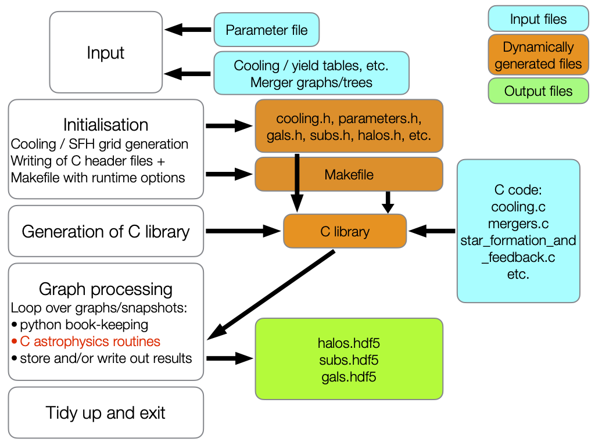
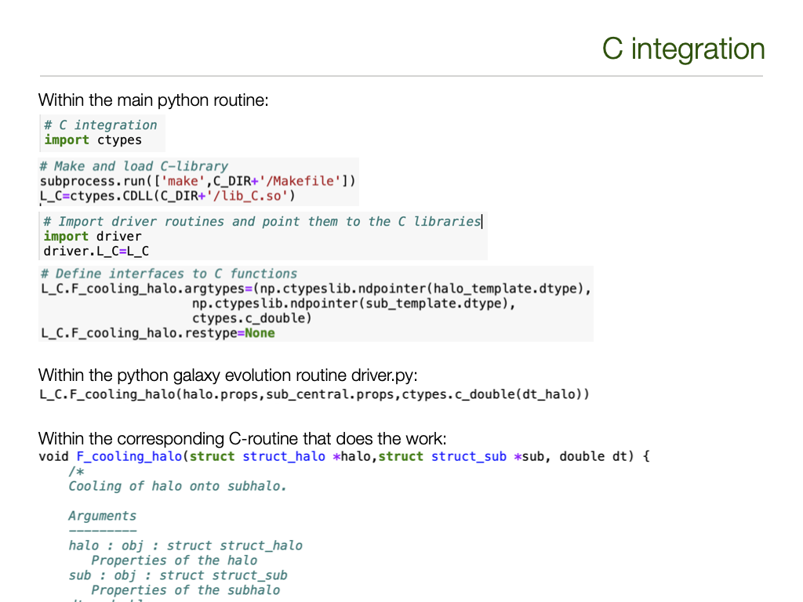

C integration
=============

Within py-galaxies all the I/O is done using the python front end as that is **much** simpler to use and more flexible than in C.  However, the bulk of the galaxy formation modelling is undertaken in C because that is much more CPU efficient.  This section describes how the integration between python and C is implemented, using `ctypes`.

First a note on some basic principles:

* `Parameters`, i.e. quantities that are fixed throughout the run, are stored in C header files (.h files) and thus imported at compilation time.
* `Variables` are all passed explicitly - there are no global variables within the C routines!
* To begin with, I attempted to make explicit all function arguments.  However, this got quite messy to read and, more importantly, the number of arguments depends upon the runtime options which then results in messier C code.  For that reason, I have packaged up some of the time-stepping arguments within a ctypes structure, :code:`variables`.
* All C function arguments are therefore either:

  - a 1-D halo structured numpy array :code:`halo.props`;
  - a 1-D subhalo structured numpy array :code:`sub.props`;
  - a galaxy structured numpy array :code:`gals`;
  - the :code:`variables` ctypes structure.

The following figure shows the basic outline of the code:

Input and initialisation
------------------------

Everything is controlled by the parameters stored in the input file `input/input.yml`.  That includes both the location and names of the input trees, cooling functions, yields tables, etc., and of the output files, but also the run-time parameters used to define the astrophysics content and the output options (eg whether to record star formation histories or not).

During initialisation, the parameters in the YAML (.yml) file are read in and stored in an instance of the parameters class.  At this time, appropriate dimensionless versions of variables and constants are generated and also stored.  An equivalent C struct that holds all these values is then generated and stored in code-C/parameters.h.  Hence, after initialisation:

* None of the values in the parameters class instance should be changed -- the parameters are fixed throughout the run.
* The parameter values are inserted into the C-code during the compilation stage -- they do not need to be passed explicitly in function calls.

Also during initialisation:

* A dimensionless version of the cooling tables is generated and stored in code-C/cooling.h.
* Numpy dtypes are generated to hold the physical properties of halos, subhalos and galaxies, and equivalent structs are written out to C header files in code-C: halos.h subs.h gals.h.  The precise structure of these will depend upon the run-time options in the input YAML file.
* If star formation histories are enabled, then helper tables are generated and stored in both in an instance of an SFH class and in a header file code-C/sfh.h.
* A makefile code-C/Makefile is written out specifying which C files to compile and with an appropriate list of -D compile-time flags.
  
The Makefile is now executed to generate the library of C routines.

Graph processing
----------------

Graphs are processed one at a time.  Each is read in to an instance of a python graph class.  The graph contains information on the halo properties as well as the merger graph links.  Currently the entire graph is loaded into memory in one go; if this proves too memory-intensive then the code could be modified to read in one snapshot at a time.

Currently halos and subhalos are also generated as required as instances of python halo and subhalo classes.  This has the advantage that properties/attributes can easily be added at will within the code, and that methods can be attached to the class.  All physical variables that need to be passed to the C-routines are stored within a numpy structured record (ie a 1-D numpy structured array) within the halo or subhalo instance.  As classes are both memory and CPU-intensive, it may be necessary to switch to simply using numpy arrays and converting the class methods to standalone functions.

Because galaxies are where most of the action is, and hence both memory and CPU-intensive, they are implemented as numpy structured arrays without any other overhead.

Snapshots are processed, one at a time, from past to present.  At any given snapshot, new halos, subhalos and galaxies are allocated and then properties are propagated from the previous one.  Thus, at most 2 snapshots need to be held in memory at any given time.  This is all handled within driver.py by the function F_update_halos.  A second python function F_process_halos then calls the C routines to perform the astrophysics.

C interface
-----------

The C interface is handled using ctypes which is a python module that allows one to pass python variables into C functions.  An outline of the calling method is shown in the following figure:

After importing ctypes and making the library of C functions, as described above, the next step is to call :code:`ctypes.CDLL` to create a python object that points to that library: with py-galaxies that is called :code:`L_C`.  That then must be made visible to any python modules that use the library functions.

Before calling a C function, one needs to define the interface (similar to a prototype function definition in C).  That is done separately for the arguments and return values using :code:`L_C.<function_name>.argtypes` and :code:`L_C.<function_name>.restype`, as shown in the example.  The most common ctypes that we need in the code are:

* :code:`ctypes.c_bool` -  the equivalent C bool type, as defined in stdbool.h.
* :code:`ctypes.c_int` -  the equivalent C int type (probably 32 bit).
* :code:`ctypes.c_double` - the equivalent C double type (probably 64 bit).
* :code:`ctypes.byref(<ctypes object>)` - the memory address of the relevant object, needed if you want to change the value of the variable within the function (equivalent to passing by address :code:`&variable` in C).  This is faster than using :code:`ctypes.POINTER(<ctypes_object>)` which creates a pointer type and passes that instead: the former is almost always what we want.
* :code:`ctypes.np.ctypeslib.ndpointer(<numpy dtype>)` - a pointer to a numpy array with the relevant dtype.  It is not obvious to me that this is what I want as:
  
  - if it actually creates a pointer then that is unnecessary overhead;
  - it prevents me passing a single row of the appropriate dtype; instead I have to pass a 1-dimensional array.
* :code:`ctypes.Structure` - The equivalent of a C structure.  :code:`ctypes.Structure` is actually a class, so one must use this to create a class instance.

So while working, there remain one or two slight annoyances to work out to make the interface neater.

I have noticed in the timing tests that a significant amount of time is spent in

* :code:`update_halos`,
* :code:`process_halos`, and
* :code:`ctypeslib.py`.

I strongly suspect that to improve efficiency I will need to:

* Switch to using numpy structured arrays for halos and subhalos rather than python classes.
* Convert the whole of :code:`driver.py`, including :code:`update_halos` and :code:`process_halos` into C.

This has the disadvantage that it moves away from treating halos and subhalos as instances of the appropriate type of object, but should significantly reduce CPU usage.

