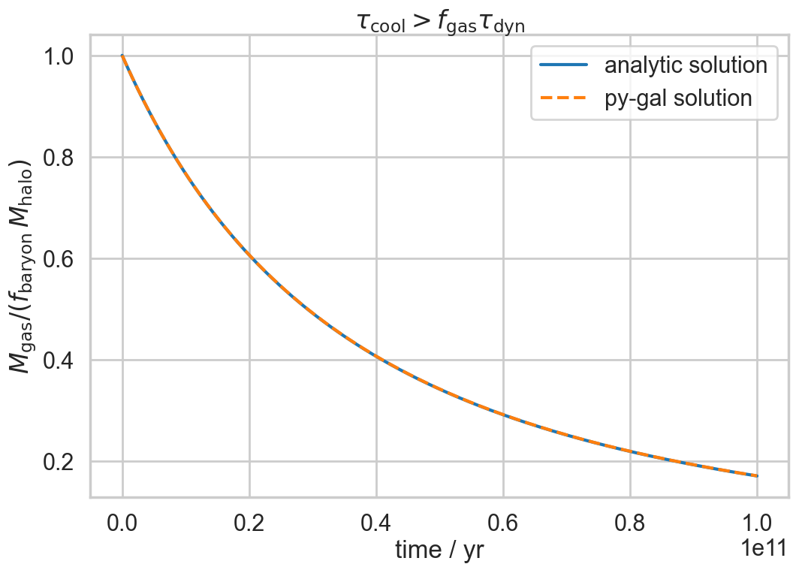
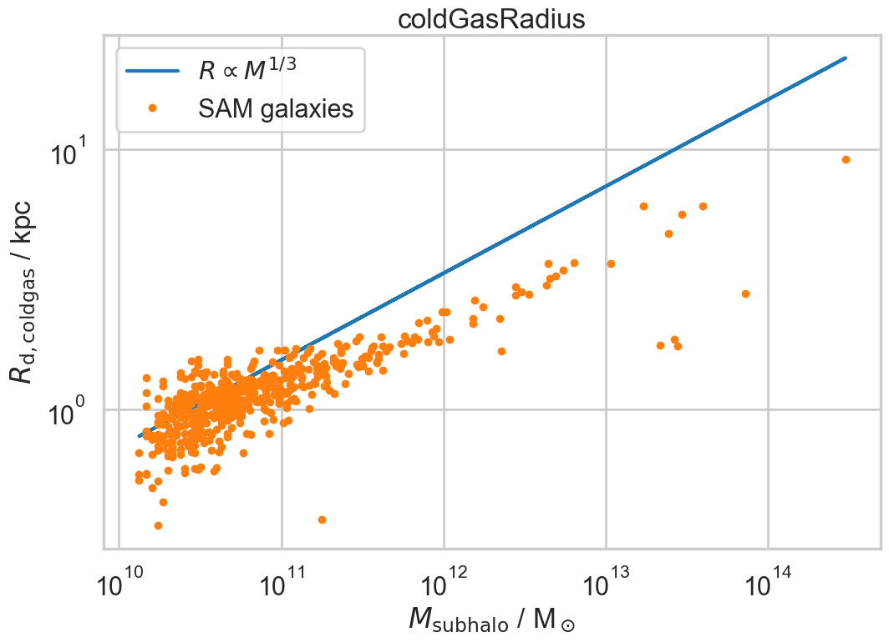
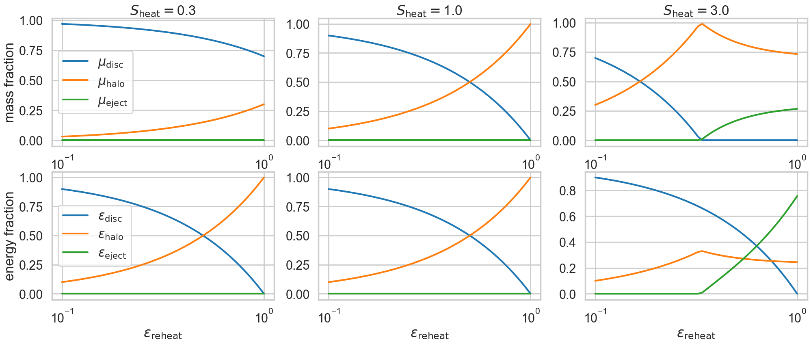
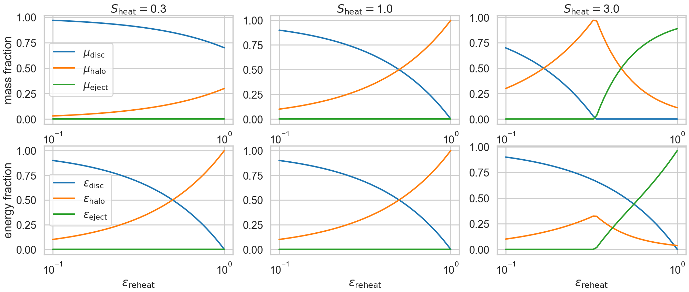
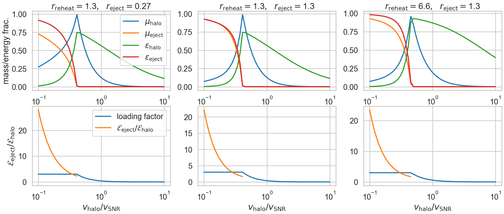

The galaxy formation model
==========================

Overview
--------

Halos
^^^^^

Halos are containers of diffuse, hot (virial temperature) gas **hot gas** (this is the intracluster gas, ICG)  and of subhalos and/or galaxies.  The gas is presumed predominantly ionised and therefore too hot for galaxy formation.

The may also contain **stars** (intracluster stars) that have been stripped from galaxies and/or subhalos.

Accretion
:::::::::

On each timestep, the baryonic content of each halo is checked and, if less than the global mean, it is topped up to that value.

Cooling
:::::::
  
* If there is a central subhalo, then the hotgas will cool onto it.
* If there are one or more subhalos but no central subhalo then the cluster is deemed to be in a dynamically turbulent state and there will be no cooling.
* If there are no subhalos then, for now, no cooling takes place: this may be relaxed in later versions of the code to allow galaxy formation to begin in lower mass halos.

Subhalos
^^^^^^^^

Subhalos are the dark mater halos within which galaxies form and reside.

Their virial temperature is typically lower than that of the host halo.  They contain **hot gas** (the galactic corona).

Galaxy merging
::::::::::::::

At the beginning of each timestep, check for merging of satellite galaxies onto the central galaxy.  This will trigger a rearrangement of both stars and cold gas within the central galaxy, dependent upon the change in angular momentum.  It may or may not require imposition of an explicit starburst phase, or that may arise naturally from the compression of cold gas -- to be determined.  The black hole of the satellite will merge onto that of the central galaxy.

Stripping
:::::::::

Satellite subhalos may have hot gas removed and transferred to the host halo either by tidal or ram pressure stripping.  Similarly, stars may be stripped from the central galaxy and/or whole satellite galaxies disrupted and transferred to the stellar component of the host halo.

Accretion
:::::::::

The subhalo, if it is a central subhalo, may have accreted hot gas from the host halo.

Cooling
:::::::

Hot gas will cool onto the central galaxy.

Galaxies
^^^^^^^^

Galaxies are comprised of **cold gas** (the interstellar medium, ISM), **disc** stars, **bulge** stars and a **black hole**.

Accretion
:::::::::

The cold gas may have accreted cooling gas from the containing subhalo.

Star Formation
::::::::::::::

The cold gas disc is broken up into annular rings.  Within each ring, star formation may occur (dependent upon the particular physical model for star formation, but typically requiring the gas to exceed a critical surface density threshold).  The stars will form within the stellar disc.

Star formation will trigger feedback of mass and metals from the cold gas into the hot gas of the enclosing subhalo.  In extreme cases, feedback may push material out of the subhalo and into the host halo.

Black hole accretion
::::::::::::::::::::

The black hole of the central galaxy will accrete some diffuse gas from the hot gas of the subhalo.  This will result in radio mode feedback of energy that pushes hot gas from the subhalo to the host halo.

Halos
-----

Properties
^^^^^^^^^^

In MEGA, galaxies do not come with a virial speed, needed to determine the virial temperature.  However, they have 2 measures that can be used for this purpose:

* 3D_velocity_dispersion, :math:`\sigma_3`
* mass / half_mass_radius

Consider the simple isothermal sphere (SIS) for which :math:`m=2\sigma^2r/G`, where :math:`m(r)` is the mass within radius :math:`r`, :math:`\sigma` is the (constant) 1-D velocity dispersion, and :math:`G` is the gravitational constant.
Then :math:`\sigma^2=Gm/2r`, where we can evaluate at any radius.

We then expect :math:`\sigma_3^2=3\sigma^2`.

Here is a plot showing the results of evaluating :math:`\sigma` these two different ways:

.. image:: figs/vdisp.png
   :width: 600
   :alt: halo 1-D velocity dispersions versus halo mass

The solid line shows the theoretical relation expected for the SIS model with an overdensity relative to critical of :math:`\Delta=100`; given that the halos are almost certainly not SIS and the overdensity captured by the FoF is in the range 90--165 (Section 2.1.1 of MEGA paper) then this is an acceptable agreement.  The turn-down at small masses is almost certainly due to the finite softening affecting halos with small particle number.

The virial temperature (i.e. the hot gas temperature) is given by the relation: :math:`k_\mathrm{B}T/\mu m_\mathrm{H}=\sigma^2`, where :math:`k_\mathrm{B}` is the Boltzmann constant and :math:`\mu m_\mathrm{H}\approx 10^{-27}` kg is the mass per particle in a fully ionised gas of cosmic metallicity.  That then gives:

.. image:: figs/temp.png
   :width: 600
   :alt: virial temperature versus halo mass

Any of the three relations on the above plot could be used to fix the virial temperature of the halo: further testing is required to see which is most robust to mergers.  For now, we use the half mass radius as that seems the most direct measure of the conditions in the dentre of the halo, where cooling will be most effective.

Accretion
^^^^^^^^^

Halos are presumed to contain a cosmic fraction of baryons (although some of those baryons may be ejected from the halo and stored in a gas_ejected phase).  At early times and in low mass halos (virial temperature close to :math:`10^4\,\mathrm{K}`) then accretion may be suppressed; this is not yet implemented and experimentation with L-Galaxies shows that it makes undetectable differences for all data sets yet investigated, which cannot resolve such small halos.

This is the first step in the astrophysics: once properties have been pushed from the previous snapshot, then the halo is topped up with hot gas (gas_hot) to the cosmic mean, but, with two provisos:

* if the inherited mass from progenitor halos exceeds the halo mass (this can happen in extreme cases) then the larger mass is used to determine the mass in baryons.
* if the halo mass has decreased and there is an excess of baryons, then these are retained (i.e. the accretion cannot become negative).

:code:`delta_baryon=max(0.,parameters.baryon_fraction*max(halo.mass,halo.mass_from_progenitors)-halo.mass_baryon)`

The following image shows a typical baryon fraction distribution.  Small halos can fluctuate above the cosmic mean because of variations in mass; that effect is much reduced in high mass halos.  The visible lines in the plot show the evolution in baryon fraction for individual halos as they increase in mass from one snapshot to the next.  Incidentally, this plot was produced with MEGA merger graphs; the fluctuations above the mean are much larger in other merger trees.

.. image:: figs/bfrac.png
   :width: 600
   :alt: baryon fraction versus halo mass

Cooling
^^^^^^^

The cooling of hot gas within halos at current times is very slow (i.e. the cooling time greatly exceeds the dynamical time of the halo, but at early times can be very rapid.  In the first instance, observations show that the gas actually remains at a roughly constant temperature as it cools, either through inflow, or by the fact that it is multiphase: we can therefore assume that the temperature of the hot gas remains fixed at the virial temperature of the halo.  In the case where the  cooling time is short, this will not be a good approximation, but in that case an error in estimating the cooling rate will not really matter, as the cooling time is shorter than other timescales of interest.

The L-Galaxies model estimates a cooling rate and sets the cooled mass to be :math:`\Delta M=\min(M,\dot{M}_\mathrm{cool}\Delta t)`, where :math:`M` is the hot gas mass and :math:`\Delta t` is the timestep.  The model used here improves on this by integrating the cooling is integrated as the gas density falls over the timestep, so that it can never drop to zero.

An explanation of the isothermal model and derivation of the expression for the amount of gas cooled can be found in :download:`this draft paper <../../docs/Cooling.pdf>` (that will never see the light of day).

The workings in that paper show that the cooling has two regimes; one in which the cooling radius lies inside the virial radius of the halo, and a second where it lies outside (then, as the gas cools and is deposited from the hot gas, the cooling radius will move to fall inside the halo).  The behaviour is determined by the dynamical and cooling timescales, where we use :math:`\tau` rather than :math:`t` to indicate that the timescales don't vary over the duration of the cooling:

.. math::

   \tau_\mathrm{dyn} = {r_{200c}\over v_{200c}} \approx {2r_\mathrm{half}\over \surd{2}\sigma}.

   \tau_\mathrm{cool} = {9\mu m_\mathrm{H} (n_t^2/n_e n_i) k_\mathrm{B} \Delta T\over 400\rho_c\Lambda}.

In these expressions the subscript :math:`c` refers to the critical density, with :math:`\rho_c` being the critical density; :math:`r_\mathrm{half}` is the half mass radius (equal to one half of the outer, 'virial' radius in the SIS model); and :math:`\Lambda(T,Z)` is the cooling function -- the cooling rate per unit density of electrons and ions, a function of both temperature and metallicity, :math:`Z`.  The combination :math:`n_t^2/n_e n_i\approx` converts the densities used to define :math:`\Lambda` into total particle density rather than that of the electrons and ions separately.  There is one minor variation from the expression in the paper in that we use :math:`\Delta T` rather than :math:`T`: that is because we are considering cooling from the halo onto the subhalo for which the temperature difference may be small compared to the halo temperature.

The combination :math:`200\rho_c` is the mean density of the halo and is appropriate when halos are defined as spherical overdensities enclosing 200 times the critical density.  For the case of MEGA halos, it can be replaced with :math:`\bar\rho=3M/32\pi r_\mathrm{half}^3`, where :math:`M` is the total halo mass and :math:`r_\mathrm{half}` is the half-mass radius, i.e.  the radius enclosing half the total mass.

It is also unclear as to whether we should use the specific enthalpy :math:`5k_\mathrm{B}T/\mu m_\mathrm{H}`, or specific entropy :math:`3k_\mathrm{B}T/\mu m_\mathrm{H}`: the former is more appropriate for cooling on a timescale that is greater than the dynamical time as the gas will then have work done on it as it flows into the centre of the halo potential: that then changes the factor in the numerator of the above equation from 9 to 15.

With both these changes then we obtain a revised expression

.. math::

   \tau_\mathrm{cool} = {80\pi\mu m_\mathrm{H}k_\mathrm{B} (n_t^2/n_e n_i)r_\mathrm{half}^3 \Delta T\over M\Lambda}.

Take :math:`f_{g0}` and :math:`f_g` to be the initial and final gas fractions, respectively.  Then the following combinations also turn out to be useful in the expressions below for :math:`f_g(f_{g0},\Delta t)`: :math:`\tau_\mathrm{ratio}= \tau_\mathrm{dyn}f_{g0}/\tau_\mathrm{cool}`, and :math:`\tau_\mathrm{eq}=\tau_\mathrm{dyn}\ln\tau_\mathrm{ratio}`.

As well as varying with the overall gas density, the cooling rate also depends upon the density profile of the hot gas.  We have currently implemented two different models:

* SIS -- singular isothermal sphere.
  The gas profile is assumed to be that of a singular isothermal sphere (as is that of the dark matter).  The SIS has a uniform temperature, :math:`T`, the virial temperature, with :math:`k_\mathrm{B}T/\mu m_\mathrm{H}=\sigma^2`, where :math:`k_\mathrm{B}` is the Boltzmann constant, :math:`\mu m_\mathrm{H}\approx 10^{-27}` kg is the mass per particle in an ionised gas of cosmic composition, and :math:`\sigma` is the 1-D velocity dispersion, as mentioned above.
  
  It is understood that this is a poor approximation to the gas profile in the central regions of any halo, but that does not matter, except in the largest halos, because the cooling time, :math:`\tau_\mathrm{cool}`, in the central regions will anyway be less than the dynamical time, :math:`\tau_\mathrm{dyn}`, in the halos.  The model assumes that gas for which :math:`\tau_\mathrm{cool}<\tau_\mathrm{dyn}` will cool, whereas other gas will not.  This may seem like a crude approximation, but in fact it performs reasonably well compared to a more sophisticated beta model (see below), as evidenced in the paper linked to above.

  The two cooling regimes then result in the following expressions for the total amount of gas cooled.  For :math:`\tau_\mathrm{ratio}<1` then

  .. math::

     f_g = f_{g0} \left( 1 + {\tau_\mathrm{ratio}^{1/2}\Delta t\over 2\tau_\mathrm{dyn}} \right)^{-2}

  whereas for :math:`\tau_\mathrm{ratio}>1`

  .. math::

      f_g = f_{g0}
         \begin{cases} 
           e^{-\Delta t/\tau_\mathrm{dyn}},& \Delta t\leq \tau_\mathrm{eq};\\
           \tau_\mathrm{ratio}^{-1}\left(1+{\Delta t-\tau_\mathrm{eq}\over2\tau_\mathrm{dyn}}\right)^{-2},&  \Delta t>\tau_\mathrm{eq};
         \end{cases}

It is hard to test the implementation of the cooling, but here at least is a plot comparing the analytic solution with one obtained by integrating multiple times using the py-galaxies cooling routines, for a long cooling time:

	 
* beta -- a beta profile, with :math:`\beta={2\over3}`.
  The density profile of the gas is assumed to follow a beta profile with :math:`\beta={2\over3}`, :math:`\rho\propto(1+y^2)^{-1}`, where :math:`y=r/a` and :math:`a` is the core radius.  At large radii, this reverts to the SIS and we assume that the gas temperature is isothermal as for that model; for small radii, the temperature would deviate slightly from isothermal, but we continue to treat it as isothermal.  

  Not yet implemented.

Note that the underlying density profile will be an NFW profile `Navarro, Frenk & White <https://en.wikipedia.org/wiki/Navarro–Frenk–White_profile>`_ so the whole situation is rather more complicated than we have assumed, but implementing the increased complexity would almost certainly make very little difference to the results and would slow down the code.

Gas disc radius
---------------

For an exponential disc of mass :math:`M` and scale-length :math:`R_\mathrm{d}` embedded within a halo that maintains a constant rotation speed, :math:`v`, the angular momentum is :math:`J=2MvR_\mathrm{d}`.  We can thus determine :math:`R_\mathrm{d}` if we know :math:`J`.

The equivalent relation for a singular isothermal sphere (SIS) is :math:`J={1\over2}MvR=MvR_\mathrm{half}`, where :math:`R_\mathrm{half}={1\over2}R` is the half mass radius.

There are two models to determine the angular momentum of newly cooled gas:

* If the input data does not include the angular momentum of the halo then we assume that cooling gas transfers and angular momentum value :math:`J=\lambda \Delta M vR_\mathrm{half}` where :math:`\lambda` is a parameter of the model that gives the angular momentum as a fraction of that expected for an SIS halo rotating at the virial speed, :math:`\Delta M` is the amount of gas cooled and :math:`R_\mathrm{half}` is the half mass radius of the halo.  The angular momentum is presumed to align with that of the gas disc.
  
* More generally, if we know the (vector) angular momentum of the halo, then the accreted gas is presumed to have the same specific angular momentum as that and we do a vector sum to determine the angular momentum of the gas disc after accretion.

In each case the cold gas disc will expand or contract according to its new specific angular momentum: :math:`R_\mathrm{d}=J/(2Mv)`.  The following figure shows an example relation using :math:`\lambda=0.06`: note that there is no star formation and feedback included in the model that generates this plot.

	 

Star formation
--------------

..  For molecular gas, `Sun etal 2023 <https://arxiv.org/abs/2302.12267>`_ give :math:`\dot{M}_\mathrm{star}=M_\mathrm{mol}/\tau_\mathrm{SFR}` where :math:`\tau_\mathrm{SFR}=10^{9.4}\,` yr for nearby galaxies.  There is some residual scatter which could, presumably, correlate with different local environment, such as dynamical time of the disc.

In general the star formation rate is based on a formula of the kind

.. math::
	\dot{M}_\mathrm{star}\propto{(M_\mathrm{SFgas}-M_\mathrm{crit})\over t_\mathrm{dyn}},

where :math:`M_\mathrm{SFgas}` is the mass of star forming gas, :math:`M_\mathrm{crit}` ia a star forming threshold (that may be zero) and :math:`t_\mathrm{dyn}` is the dynamical time.

Depending upon the model, :math:`M_\mathrm{SFgas}` may be the total mass of the cold disc, or the mass of molecular gas, and may or may not be split up into annular rings.

Simple model
^^^^^^^^^^^^

The simplest model, used in `L-Galaxies 2015 <https://arxiv.org/abs/1410.0365>`_, takes

.. math::
	\dot{M}_\mathrm{star}=\alpha_\mathrm{SFR}{(M_\mathrm{cold\,gas}-M_\mathrm{crit})\over t_\mathrm{dyn}},

where :math:`t_\mathrm{dyn}=R_\mathrm{d}/v` is the dynamical time at a radius equal to the cold gas disc scale length, :math:`R_\mathrm{d}`.

Here

.. math::
   M_\mathrm{crit}=M_\mathrm{crit,0}\left(v\over200\mathrm{km}\,\mathrm{s}^{-1}\right)\left(R_\mathrm{d}\over10\,\mathrm{kpc}\right).

Both :math:`\alpha_\mathrm{SFR}` and :math:`M_\mathrm{crit,0}` are taken to be free parameters of the model, with typical values:

* :math:`\alpha_\mathrm{SFR}=0.025`;
* :math:`M_\mathrm{crit,0}=2.4\times10^9\mathrm{M}_\odot`.

The model assumes that the disc scale length is unaffected by star formation, whereas in practice we might expect stars to form mainly from the central regions where the molecular gas fraction is higher and the local dynamical time is shorter.

Stellar feedback
----------------

Stellar feedback is presumed to be prompt and mostly from radiation pressure around young star-forming regions and Type II supernovae -- there will also be later feedback from AGB winds and Type Ia supernovae, but this will be more isolated and sporadic and it is assumed that the heated gas will quickly cool back onto the cold gas disk (ISM).

The energy available from supernovae, :math:`\Delta E_\mathrm{SNR}` will be proportional to the mass of stars produced, :math:`\Delta M_*`,

.. math::

   \Delta E_\mathrm{SNR}={1\over2}\Delta M_*v_\mathrm{SNR}^2,

where :math:`v_\mathrm{SNR}` is a parameter of the model.

We assume that this energy gets injected into an amount of gas, :math:`\Delta_\mathrm{heat}`, that is directly proportional to :math:`\Delta M_*`,

.. math::

   \Delta M_\mathrm{heat}=F_\mathrm{heat}\Delta M_*,

where :math:`F_\mathrm{heat}` is a fixed parameter.  We can write

.. math::

   \Delta E_\mathrm{SNR}=\mathcal{E}_\mathrm{SNR}\Delta M_\mathrm{heat},\ \ \mathrm{where}\ \ \mathcal{E}_\mathrm{SNR}={v_\mathrm{SNR}^2\over2F_\mathrm{heat}}

is the effective specific energy that SNR inject into the surrounding gas.

Of this energy, some will be used up in heating gas that then rapidly cools down and is reassimilated into the cold gas disc (ISM); some will heat gas high enough that it joins the corona (i.e. subhalo hot gas) and some will heat gas to a high enough temperature that it escapes the subhalo altogether (ie ejected gas).  To keep the model simple, we place this gas not in the halo (from where it could escape still further) but into an **Ejected** phase that is loosely bound to the halo but not within the virial radius.  That gas will become available for re-accretion onto the halo once its (mean) entropy drops below that of the halo gas.  We write

.. math::

   \Delta E_\mathrm{SNR}=\Delta E_\mathrm{disc}+\Delta E_\mathrm{halo}+\Delta E_\mathrm{eject} =\Delta E_\mathrm{SNR}(\epsilon_\mathrm{disc}+\epsilon_\mathrm{halo}+\epsilon_\mathrm{eject}),

where :math:`\epsilon_\mathrm{disc}+\epsilon_\mathrm{halo}+\epsilon_\mathrm{eject}=1`.  For consistency with previous nomenclature, we write :math:`\epsilon_\mathrm{reheat}=\epsilon_\mathrm{halo}+\epsilon_\mathrm{eject}`.

Similarly

.. math::

   \Delta M_\mathrm{heat}=\Delta M_\mathrm{disc}+\Delta M_\mathrm{halo}+\Delta M_\mathrm{eject} =\Delta M_\mathrm{heat}(\mu_\mathrm{disc}+\mu_\mathrm{halo}+\mu_\mathrm{eject}),

where :math:`\mu_\mathrm{disc}+\mu_\mathrm{halo}+\mu_\mathrm{eject}\equiv\mu_\mathrm{disc}+\mu_\mathrm{reheat}=1`.

In low mass halos for which the virial speed of the halo is such that :math:`v_\mathrm{vir}\ll v_\mathrm{SNR}`, then most mass will be ejected; on the other hand, if :math:`v_\mathrm{vir}\gg v_\mathrm{SNR}` then almost all gas will fail to heat up to the virial temperature of the subhalo.  It is not unreasonable then to treat the :math:`\epsilon` s and :math:`\mu` s as decreasing functions of :math:`v_\mathrm{vir}/v_\mathrm{SNR}`.

In our model it is the energy injected into the ISM that determines the degree of reheating; therefore we treat :math:`\epsilon_\mathrm{reheat}` as a fundamental parameter.  We take it to vary as

.. math::

   \epsilon_\mathrm{reheat}={1\over 1+\left(v_\mathrm{vir}\over v_\mathrm{reheat}\right)^\eta},

where :math:`\eta>0` and :math:`v_\mathrm{reheat}` are (constant) parameters of the model.

If all the energy were evenly distributed between the three phases, then the :math:`\mu` s would equal the :math:`\epsilon` s.  However, the gas that falls back onto the disc will get less energy than average and that which is ejected will get more; hence we expect :math:`\mu_\mathrm{disc}>\epsilon_\mathrm{disc}` and :math:`\mu_\mathrm{eject}<\epsilon_\mathrm{eject}`.  However, we also have to ensure that the total energy is sufficient to reheat the desired amount of gas.

We assume that the average specific energy of gas that ends up in the corona is  :math:`\mathcal{E}_\mathrm{halo}={3\over4}v_\mathrm{vir}^2`, which is the energy required to raise gas to the virial temperature of the subhalo assuming that no work is done against pressure forces.  Hence the maximum possible value of :math:`\mu_\mathrm{reheat}` is

.. math::

   \mu_\mathrm{reheat,max}=\mathcal{S}_\mathrm{heat}\epsilon_\mathrm{reheat},\ \ \mathrm{where}\ \mathcal{S}_\mathrm{heat}={\mathcal{E}_\mathrm{SNR}\over\mathcal{E}_\mathrm{halo}}={2 v_\mathrm{SNR}^2\over3 F_\mathrm{heat} v_\mathrm{vir}^2}

This then motivates the following:

* :math:`\mu_\mathrm{reheat,max}\leq1`:
  Insufficient energy to reheat all the gas up to the virial temperature of the subhalo.  As an approximation, assume no ejected gas.  Then:
  
  - :math:`\mu_\mathrm{disc}=1-\mu_\mathrm{reheat,max}`, :math:`\epsilon_\mathrm{disc}=1-\epsilon_\mathrm{reheat}`;
  - :math:`\mu_\mathrm{halo}=\mu_\mathrm{reheat,max}`, :math:`\epsilon_\mathrm{halo}=\epsilon_\mathrm{reheat}`;
  - :math:`\mu_\mathrm{eject}=0`, :math:`\epsilon_\mathrm{eject}=0`.

* :math:`\mu_\mathrm{reheat,max}>1`:
  More than enough energy to raise all the heated gas up to the virial temperature.  As an approximation, assume that negligible mass in contained in the gas that cools back down onto the disc (this assumption could be relaxed).  We then need to decide what fraction of the mass goes into halo and ejected gas, for which we use a functional form similar to that given above.  The extra factor involving :math:`\mu_\mathrm{reheat,max}` is to give a smooth transition as :math:`\epsilon_\mathrm{reheat}` increases; it is not crucial to the model and could be omitted.

  .. math::

      \mu_\mathrm{eject}={\mu_\mathrm{reheat,max}^2-1\over\mu_\mathrm{reheat,max}^2}. {1\over 1+\left(v_\mathrm{vir}\over v_\mathrm{eject}\right)^\eta},
  

  - :math:`\mu_\mathrm{disc}=0`, :math:`\epsilon_\mathrm{disc}=1-\epsilon_\mathrm{reheat}`;
  - :math:`\mu_\mathrm{halo}=1-\mu_\mathrm{eject}`, :math:`\epsilon_\mathrm{halo}=\mu_\mathrm{halo}/\mathcal{S}_\mathrm{heat}`;
  - :math:`\mu_\mathrm{eject}=` above formula, :math:`\epsilon_\mathrm{eject}=\epsilon_\mathrm{reheat}-\mu_\mathrm{halo}/\mathcal{S}_\mathrm{heat}`.

  Finally, to determine the entropy of ejected gas, we need to know its specific energy, :math:`\mathcal{E}_\mathrm{eject}`:

  .. math::

     \mathcal{E}_\mathrm{eject}={\epsilon_\mathrm{eject}\over\mu_\mathrm{eject}}\mathcal{S}_\mathrm{heat}\mathcal{E}_\mathrm{halo}.
   
  In order that :math:`\mathcal{E}_\mathrm{eject}>\mathcal{E}_\mathrm{halo}` we require that :math:`\epsilon_\mathrm{reheat}\mathcal{S}_\mathrm{heat}\equiv\mu_\mathrm{reheat,max}>1`, which is guaranteed by our model.

The model has five free parameters: :math:`F_\mathrm{heat},\ \nu,\ v_\mathrm{SNR},\ v_\mathrm{reheat},\ \&\ v_\mathrm{eject}` (although we note that L-Galaxies fixes :math:`v_\mathrm{SNR}=630\,\mathrm{km}\,\mathrm{s}^{-1}`). That makes it difficult to show plots covering the variation of all parameters.  
For the purposes of illustration here, we fix :math:`\eta=1` and :math:`F_\mathrm{heat}=3`.  The ratio :math:`f_\mathrm{reheat}=\Delta M_\mathrm{reheat}/\Delta M_*=F_\mathrm{heat}\mu_\mathrm{reheat}` is known as the *loading factor* and is highly uncertain observationally but is typically of order a few for Milky Way sized halos; our model therefore limits the loading factor to be less than or equal to :math:`F_\mathrm{heat}`.  The reheating mass and energy fractions then depend upon the ratios :math:`r_\mathrm{reheat}=v_\mathrm{reheat}/v_\mathrm{SNR}` and :math:`r_\mathrm{eject}=v_\mathrm{eject}/v_\mathrm{SNR}`.

The following plot shows the variation of mass and ejection fractions as a function of :math:`\epsilon_\mathrm{reheat}` for :math:`\mu_\mathrm{eject,max}=0.3`

and for :math:`\mu_\mathrm{eject,max}=1.0`

The following plots show inthe top row the variation of mass and ejection fractions as a function of the ratio of :math:`v_\mathrm{vir}/v_\mathrm{SNR}`: in columns, from left to right, :math:`r_\mathrm{reheat}=0.76`, :math:`r_\mathrm{eject}=0.16` (this seems most similar to the parameters in Hen15); :math:`r_\mathrm{reheat}=0.76`, :math:`r_\mathrm{eject}=0.76`; :math:`r_\mathrm{reheat}=3.8`, :math:`r_\mathrm{eject}=0.76`.  The bottom row shows the mass loading factor and the ratio of the specific energy in the ejected gas relative to that of the halo: this latter is always greater than unity, as required.  I am not entirely convinced that last plot is correct, but can't find anything wrong with it - the key parameter in the model is clearly :math:`F_\mathrm{heat}` which determines the halo virial velocity at which the mean injected specific energy from SNR into the heated gas equals that of the coronal gas.

	 
