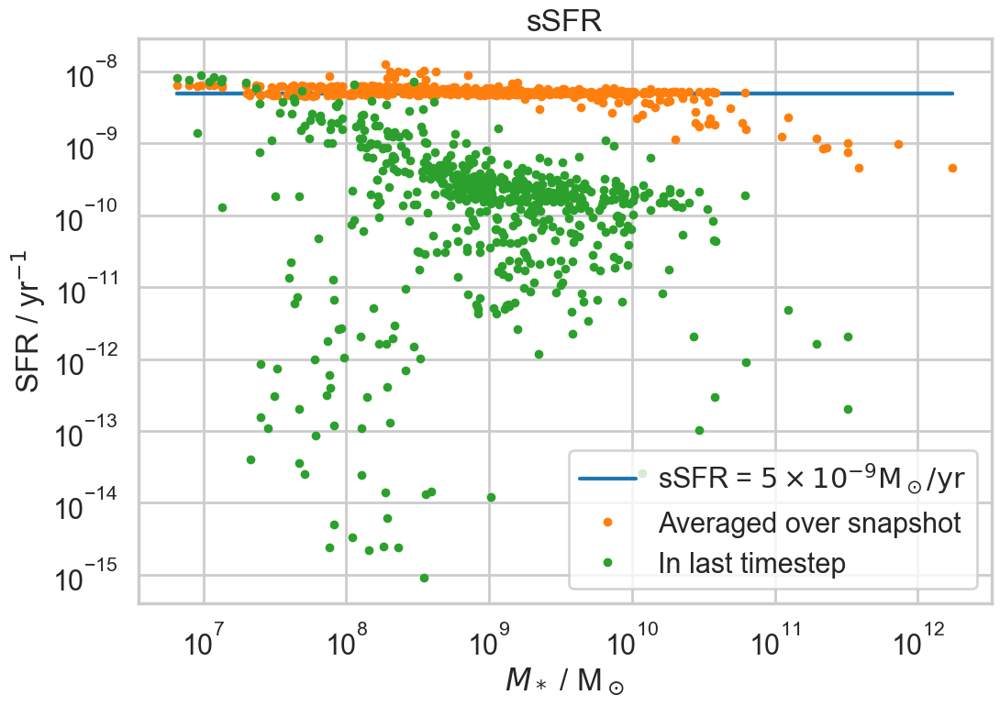
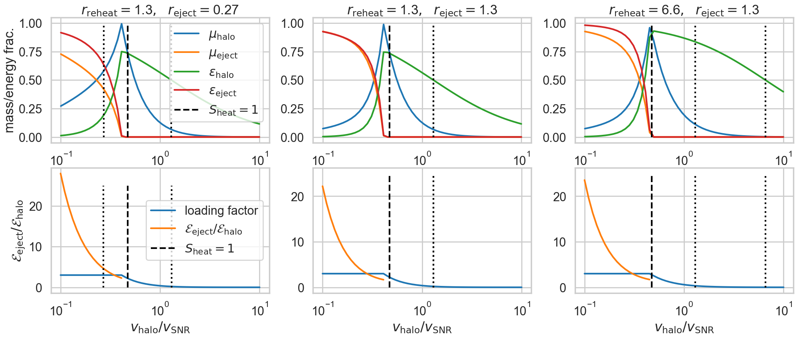

The galaxy formation model
==========================

Overview
--------

Halos
^^^^^

Halos are containers of diffuse, hot (virial temperature) gas **hot gas** (this is the intracluster gas, ICG)  and of subhalos and/or galaxies.  The gas is presumed predominantly ionised and therefore too hot for galaxy formation.

Within the halo instances, we also keep track of **Ejected gas** that has been given enough energy from stellar feedback to be pushed beyond the outer radius of the halo.

They may also contain **stars** (intracluster stars) that have been stripped from galaxies and/or subhalos.

Accretion
:::::::::

On each timestep, the baryonic content of each halo is checked and, if less than the global mean, it is topped up to that value.

Reincorporation
:::::::::::::::

Gas that has been ejected from the halo may be reincorporated into the hot gas phase of the halo.

Stripping
:::::::::

Satellite subhalos may have hot gas removed and transferred to the host halo either by tidal or ram pressure stripping.  Similarly, stars may be stripped from non-central galaxies and/or whole satellite galaxies disrupted and transferred to the stellar component of the host halo.

Cooling
:::::::
  
* If there is a central subhalo, then the hotgas will cool onto it.
* If there are one or more subhalos but no central subhalo then the cluster is deemed to be in a dynamically turbulent state and there will be no cooling.
* If there are no subhalos then, for now, no cooling takes place: this may be relaxed in later versions of the code to allow galaxy formation to begin in lower mass halos.

Subhalos
^^^^^^^^

Subhalos are the dark mater halos within which galaxies form and reside.

Their virial temperature is typically lower than that of the host halo.  They contain **hot gas** (the galactic corona).

They may also contain **stars** (intracluster stars) that have been stripped from non-central galaxies.

Galaxy merging
::::::::::::::

At the beginning of each timestep, check for merging of satellite galaxies onto the central galaxy.  This will trigger a rearrangement of both stars and cold gas within the central galaxy, dependent upon the change in angular momentum.  It may or may not require imposition of an explicit starburst phase, or that may arise naturally from the compression of cold gas -- to be determined: for now we follow previous models by triggering a starburst if the mass ratio of the merging satellites is close to unity.  The black hole of the satellite will merge onto that of the central galaxy and also trigger BH accretion and quasar activity.

Cooling
:::::::

Hot gas will cool onto the central galaxy, if that exists.

Galaxies
^^^^^^^^

Galaxies are comprised of **cold gas** (the interstellar medium, ISM), **disc** stars, **bulge** stars and a **black hole**.

There are two alternative methods for the distribution of cold gas and disc stars:

* They may be taken to be exponential in form, each with a distinct scale-length determined by the angular momentum.
* The discs may be broken up into annular rings -- not yet implemented.

Accretion
:::::::::

The cold gas may have accreted cooling gas from the containing subhalo.

Star Formation
::::::::::::::

Star formation may occur within the cold gas disc (dependent upon the particular physical model for star formation, but typically requiring the gas to exceed a critical surface density threshold).  The stars will form within the stellar disc.

Star formation will trigger feedback of mass and metals from the cold gas into the hot gas of the enclosing subhalo.  In extreme cases, feedback may push material out of the subhalo to become ejected gas associated with the host halo.

Stellar evolution: metal enrichment and SNR feedback
::::::::::::::::::::::::::::::::::::::::::::::::::::
  
As stellar populations age, first massive stars and then gradually younger and younger stars reach the end of their lives, releasing metals and energy into their surroundings.  This can be handled with two levels of complexity:

* In the simplest models, all feedback is assumed to be prompt, i.e. instantaneous.
* Alternatively, one can record the star formation history of a galaxy and feed back metals and energy in a much more gradual fashion as stars of different ages reach the end of their lives.

Some of the newly-formed metals will be retained in the cold gas by material that is insufficiently heated and can cool back down.  Some will be associated with material that is heated into the coronal gas or ejected from the halo.

Black hole growth and feedack
:::::::::::::::::::::::::::::

The black hole grows through material being pushed close to the centre of the galaxy via secular evolution (disc instability), accretion of cooling gas, and mergers.  Mergers are the main growth mechanism and can give rise to luminous quasars, whereas 'radio mode' accretion of diffuse gas gives rise to jets that provide feedback, especially in the most massive galaxies.

Halos
-----

Properties
^^^^^^^^^^

In MEGA, galaxies do not come with a virial speed, needed to determine the virial temperature.  However, they have 2 measures that can be used for this purpose:

* 3D_velocity_dispersion, :math:`\sigma_3`
* mass / half_mass_radius

Consider the simple isothermal sphere (SIS) for which :math:`m=2\sigma^2r/G`, where :math:`m(r)` is the mass within radius :math:`r`, :math:`\sigma` is the (constant) 1-D velocity dispersion, and :math:`G` is the gravitational constant.
Then :math:`\sigma^2=Gm/2r`, where we can evaluate at any radius.

Alternatively we can assuming an isotropic velocoty dispersion and set :math:`\sigma^2={1\over3}\sigma_3^2`.

Here is a plot showing the results of evaluating :math:`\sigma` these two different ways:

.. image:: figs/vdisp.png
   :width: 600
   :alt: halo 1-D velocity dispersions versus halo mass

The solid line shows the theoretical relation expected for the SIS model with an overdensity relative to critical of :math:`\Delta=100`; given that the halos are almost certainly not SIS and the overdensity captured by the FoF is in the range 90--165 (Section 2.1.1 of MEGA paper) then this is an acceptable agreement.  The turn-down at small masses is almost certainly due to the finite softening affecting halos with small particle number.

The virial temperature (i.e. the hot gas temperature) is given by the relation: :math:`k_\mathrm{B}T/\mu m_\mathrm{H}=\sigma^2`, where :math:`k_\mathrm{B}` is the Boltzmann constant and :math:`\mu m_\mathrm{H}\approx 10^{-27}` kg is the mass per particle in a fully ionised gas of cosmic metallicity.  That then gives:

.. image:: figs/temp.png
   :width: 600
   :alt: virial temperature versus halo mass

Any of the three relations on the above plot could be used to fix the virial temperature of the halo: further testing is required to see which is most robust to mergers.  We use the half mass radius as that seems the most direct measure of the conditions in the centre of the halo, where cooling will be most effective.

Accretion
^^^^^^^^^

Halos are presumed to contain a cosmic fraction of baryons (although some of those baryons may be ejected from the halo and stored in a gas_ejected phase).  At early times and in low mass halos (virial temperature close to :math:`10^4\,\mathrm{K}`) then accretion may be suppressed; this is not yet implemented and experimentation with L-Galaxies shows that it makes undetectable differences for all data sets yet investigated, which cannot resolve such small halos.

This is the first step in the astrophysics: once properties have been pushed from the previous snapshot, then the halo is topped up with hot gas (gas_hot) to the cosmic mean, but, with two provisos:

* if the inherited mass from progenitor halos exceeds the halo mass (this can happen in extreme cases) then the larger mass is used to determine the mass in baryons.
* if the halo mass has decreased and there is an excess of baryons, then these are retained (i.e. the accretion cannot become negative).

:code:`delta_baryon=max(0.,parameters.baryon_fraction*max(halo.mass,halo.mass_from_progenitors)-halo.mass_baryon)`

The following image shows a typical baryon fraction distribution.  Small halos can fluctuate above the cosmic mean because of variations in mass; that effect is much reduced in high mass halos.  *The origin of the visible lines in bottom-left of the plot is uncertain*.  Incidentally, this plot was produced with MEGA merger graphs; the fluctuations above the mean are much larger in other merger trees.

The accreted gas is assumed to have some minimum, base metallicity due to the action of unresolved star formation (Population III and dwarf galaxies).

Reincorporation of ejected gas
^^^^^^^^^^^^^^^^^^^^^^^^^^^^^^

The plan is eventually to move to a physically-motivated scheme whereby ejected gas is reincorporated when its entropy falls below that of gas at the edge of the halo (or in practice, if we assume that the density at the outer edge of the halo scales in the same way for the ICM and ejected gas, its virial temperature, scaled by the expansion factor, falls below that of the halo).

For now however, we adopt the simpler scheme outlined in Hen15 whereby the reincorporation timescale scales inversely with the mass of the halo:

.. math::

   \dot{M}_\mathrm{eject}=-{M_\mathrm{eject}\over t_\mathrm{reinc}},\ \ \mathrm{where}\ \ t_\mathrm{reinc}=\gamma_\mathrm{reinc}{10^{10}\mathrm{M}_\odot\over M_{200c}}.
   
Note that Hen15 use the symbol :math:`\gamma'` in place of :math:`\gamma_\mathrm{reinc}` but we adopt the latter as being more explicit.

Stripping
^^^^^^^^^

Not yet implemented.

Cooling
^^^^^^^

The cooling of hot gas within halos at current times is very slow (i.e. the cooling time greatly exceeds the dynamical time of the halo, but at early times can be very rapid.  In the first instance, observations show that the gas actually remains at a roughly constant temperature as it cools, either through inflow, or by the fact that it is multiphase: we can therefore assume that the temperature of the hot gas remains fixed at the virial temperature of the halo.  In the case where the  cooling time is short, this will not be a good approximation, but in that case an error in estimating the cooling rate will not really matter, as the cooling time is shorter than other timescales of interest.

The L-Galaxies model estimates a cooling rate and sets the cooled mass to be :math:`\Delta M=\min(M,\dot{M}_\mathrm{cool}\Delta t)`, where :math:`M` is the hot gas mass and :math:`\Delta t` is the timestep.  The model used here improves on this by integrating the cooling is integrated as the gas density falls over the timestep, so that it can never drop to zero.

An explanation of the isothermal model and derivation of the expression for the amount of gas cooled can be found in :download:`this draft paper <../../docs/Cooling.pdf>` (that will never see the light of day).

The workings in that paper show that the cooling has two regimes; one in which the cooling radius lies inside the virial radius of the halo, and a second where it lies outside (then, as the gas cools and is deposited from the hot gas, the cooling radius will move to fall inside the halo).  The behaviour is determined by the dynamical and cooling timescales, where we use :math:`\tau` rather than :math:`t` to indicate that the timescales don't vary over the duration of the cooling:

.. math::

   \tau_\mathrm{dyn} = {r_{200c}\over v_{200c}} \approx {2r_\mathrm{half}\over \surd{2}\sigma}.

   \tau_\mathrm{cool} = {9\mu m_\mathrm{H} (n_t^2/n_e n_i) k_\mathrm{B} \Delta T\over 400\rho_c\Lambda}.

In these expressions the subscript :math:`c` refers to the critical density, with :math:`\rho_c` being the critical density; :math:`r_\mathrm{half}` is the half mass radius (equal to one half of the outer, 'virial' radius in the SIS model); and :math:`\Lambda(T,Z)` is the cooling function -- the cooling rate per unit density of electrons and ions, a function of both temperature and metallicity, :math:`Z`.  The combination :math:`n_t^2/n_e n_i\approx` converts the densities used to define :math:`\Lambda` into total particle density rather than that of the electrons and ions separately.  There is one minor variation from the expression in the paper in that we use :math:`\Delta T` rather than :math:`T`: that is because we are considering cooling from the halo onto the subhalo for which the temperature difference may be small compared to the halo temperature.

The combination :math:`200\rho_c` is the mean density of the halo and is appropriate when halos are defined as spherical overdensities enclosing 200 times the critical density.  For the case of MEGA halos, it can be replaced with :math:`\bar\rho=3M/32\pi r_\mathrm{half}^3`, where :math:`M` is the total halo mass and :math:`r_\mathrm{half}` is the half-mass radius, i.e.  the radius enclosing half the total mass.

It is also unclear as to whether we should use the specific enthalpy :math:`5k_\mathrm{B}T/\mu m_\mathrm{H}`, or specific entropy :math:`3k_\mathrm{B}T/\mu m_\mathrm{H}`: the former is more appropriate for cooling on a timescale that is greater than the dynamical time as the gas will then have work done on it as it flows into the centre of the halo potential: that then changes the factor in the numerator of the above equation from 9 to 15.

With both these changes then we obtain a revised expression

.. math::

   \tau_\mathrm{cool} = {80\pi\mu m_\mathrm{H}k_\mathrm{B} (n_t^2/n_e n_i)r_\mathrm{half}^3 \Delta T\over M\Lambda}.

Take :math:`f_{g0}` and :math:`f_g` to be the initial and final gas fractions, respectively.  Then the following combinations also turn out to be useful in the expressions below for :math:`f_g(f_{g0},\Delta t)`: :math:`\tau_\mathrm{ratio}= \tau_\mathrm{dyn}f_{g0}/\tau_\mathrm{cool}`, and :math:`\tau_\mathrm{eq}=\tau_\mathrm{dyn}\ln\tau_\mathrm{ratio}`.

As well as varying with the overall gas density, the cooling rate also depends upon the density profile of the hot gas.  We have currently implemented two different models:

* SIS -- singular isothermal sphere.
  The gas profile is assumed to be that of a singular isothermal sphere (as is that of the dark matter).  The SIS has a uniform temperature, :math:`T`, the virial temperature, with :math:`k_\mathrm{B}T/\mu m_\mathrm{H}=\sigma^2`, where :math:`k_\mathrm{B}` is the Boltzmann constant, :math:`\mu m_\mathrm{H}\approx 10^{-27}` kg is the mass per particle in an ionised gas of cosmic composition, and :math:`\sigma` is the 1-D velocity dispersion, as mentioned above.
  
  It is understood that this is a poor approximation to the gas profile in the central regions of any halo, but that does not matter, except in the largest halos, because the cooling time, :math:`\tau_\mathrm{cool}`, in the central regions will anyway be less than the dynamical time, :math:`\tau_\mathrm{dyn}`, in the halos.  The model assumes that gas for which :math:`\tau_\mathrm{cool}<\tau_\mathrm{dyn}` will cool, whereas other gas will not.  This may seem like a crude approximation, but in fact it performs reasonably well compared to a more sophisticated beta model (see below), as evidenced in the paper linked to above.

  The two cooling regimes then result in the following expressions for the total amount of gas cooled.  For :math:`\tau_\mathrm{ratio}<1` then

  .. math::

     f_g = f_{g0} \left( 1 + {\tau_\mathrm{ratio}^{1/2}\Delta t\over 2\tau_\mathrm{dyn}} \right)^{-2}

  whereas for :math:`\tau_\mathrm{ratio}>1`

  .. math::

      f_g = f_{g0}
         \begin{cases} 
           e^{-\Delta t/\tau_\mathrm{dyn}},& \Delta t\leq \tau_\mathrm{eq};\\
           \tau_\mathrm{ratio}^{-1}\left(1+{\Delta t-\tau_\mathrm{eq}\over2\tau_\mathrm{dyn}}\right)^{-2},&  \Delta t>\tau_\mathrm{eq};
         \end{cases}

It is hard to test the implementation of the cooling, but here at least is a plot comparing the analytic solution with one obtained by integrating multiple times using the py-galaxies cooling routines, for a long cooling time:

	 
* beta -- a beta profile, with :math:`\beta={2\over3}`.
  The density profile of the gas is assumed to follow a beta profile with :math:`\beta={2\over3}`, :math:`\rho\propto(1+y^2)^{-1}`, where :math:`y=r/a` and :math:`a` is the core radius.  At large radii, this reverts to the SIS and we assume that the gas temperature is isothermal as for that model; for small radii, the temperature would deviate slightly from isothermal, but we continue to treat it as isothermal.  

  Not yet implemented.

Note that the underlying density profile will be an NFW profile `Navarro, Frenk & White <https://en.wikipedia.org/wiki/Navarro–Frenk–White_profile>`_ so the whole situation is rather more complicated than we have assumed, but implementing the increased complexity would almost certainly make very little difference to the results and would slow down the code.

Subhalos
--------

Properties
^^^^^^^^^^

The properties of subhalos mirror those of halos.

The following figure shows the range of virial speeds of subhalos compared to that of their host halos:

It can be seen that in most cases each halo contains a subhalo of very similar virial speed, plus possibly additional subhalos of lower virial speed.  In a couple of cases the subhalo has a higher virial speed than the host halo: in that case, we set the virial temperature of the subhalo to be equal to that of its host.

Galaxy merging
^^^^^^^^^^^^^^

Currently a minimal model is in place in which all galaxies in a subhalo are instantaneously merged into a single galaxy using the following procedure, which changes depending upon the mass ratio of the merging galaxies.

* The most massive galaxy is taken to become the merger remnant; the other we will call the satellite galaxy.
* The mass ratio, :math:`\mu`, is defined to be the baryonic mass of the satellite galaxy divided by that of the more massive one (befgre merging), such that :math:`0\leq\mu\leq1`.
* The cold gas discs are added together: in the development model, MEGA does not provide the angular momentum of halos, so the discs are presumed to align; this will over-estimate disc sizes.
* If :math:`\mu>=\mu_\mathrm{merge}` then a starburst is triggered that forms a mass of stars (Hen15, S33)
  
  .. math::

     M_\mathrm{*,burst}=\alpha_\mathrm{SFR,burst}\mu^\beta_\mathrm{SFR,burst}M_\mathrm{cold gas}.

  The starburst will result in SNR feedback as described in the :ref:`Stellar feedback` section below.
* The stellar bulges are added together.
* The stellar disc of the satellite is added to the bulge of the remnant.
* If :math:`\mu<\mu_\mathrm{merge}` then the stellar disc of the remnant is unchanged; otherwise it is transferred to the bulge.
* The half-mass radius of the bulge is determined using a model from `Guo et al. 2011 <https://arxiv.org/pdf/1006.0106.pdf>`_ (Hen15, S34)
  
  .. math::

     {M_\mathrm{bulge,new}^2\over r_\mathrm{bulge,new}}={M_\mathrm{bulge,1}^2\over r_\mathrm{bulge,1}} +
     {M_\mathrm{bulge,1}^2\over r_\mathrm{bulge,1}} +
     2\alpha_\mathrm{merge}{M_\mathrm{bulge,1}M_\mathrm{bulge,2}\over r_\mathrm{bulge,1}+r_\mathrm{bulge,2}},

  where the subscripts 1 and 2 represent the two galaxies and :math:`\alpha_\mathrm{merge}=0.5` is a fixed parameter that leads to sensible bulge sizes.
* The black holes of the two galaxies will merge and, in addition, the black hole will accrete an amount of cold gas as described in the section on :ref:`Galaxy mergers (quasar mode)` below.

In future, once we have angular momenta, then we will follow the (vector) angular momentum of the merging galaxies, thus potentially leading to a large contraction in the cold gas disc size.  This in turn may trigger more star formation (possibly eliminating the need for explict modelling of a starburst).

Mergers are the dominant method for forming bulges in high-mass galaxies.  The following plot shows the bulge to total stellar mass ratio for galaxies in the absence of disc instability (which is the other mechanism for bulge formation, not yet implemented).

Cooling
^^^^^^^

The hot gas in the subhalo will cool onto the galaxy in the same manner as described above for gas cooling from the halo onto the subhalo.  The temperature of the cold gas in the ISM of the galaxyy is taken to be :math:`10^4\,\mathrm{K}`.

Galaxies
--------

Properties
^^^^^^^^^^

Gas disc radius
:::::::::::::::

For an exponential disc of mass :math:`M` and scale-length :math:`R_\mathrm{d}` embedded within a halo that maintains a constant rotation speed, :math:`v`, the angular momentum is :math:`J=2MvR_\mathrm{d}`.  We can thus determine :math:`R_\mathrm{d}` if we know :math:`J`.

The equivalent relation for a singular isothermal sphere (SIS) is :math:`J={1\over2}MvR=MvR_\mathrm{half}`, where :math:`R_\mathrm{half}={1\over2}R` is the half mass radius.

There are two models to determine the angular momentum of newly cooled gas:

* If the input data does not include the angular momentum of the halo then we assume that cooling gas transfers and angular momentum value :math:`J=\lambda \Delta M vR_\mathrm{half}` where :math:`\lambda` is a parameter of the model that gives the angular momentum as a fraction of that expected for an SIS halo rotating at the virial speed, :math:`\Delta M` is the amount of gas cooled and :math:`R_\mathrm{half}` is the half mass radius of the halo.  The angular momentum is presumed to align with that of the gas disc.
  
* More generally, if we know the (vector) angular momentum of the halo, then the accreted gas is presumed to have the same specific angular momentum as that and we do a vector sum to determine the angular momentum of the gas disc after accretion.

In each case the cold gas disc will expand or contract according to its new specific angular momentum: :math:`R_\mathrm{d}=J/(2Mv)`.  The following figure shows an example relation using :math:`\lambda=0.25`.

Note:

* :math:`\lambda=0.25` seems very large but using the smaller 0.06 (which is what I had in my head) gave disc sizes that were too small.
* Need to follow up where the ridiculously large disc sizes come from (they do not correspond to extremely small cold gas masses).

Stellar disc radius
:::::::::::::::::::

The stellar disc radius is determined in the same way as the gas disc radius, by following the angular momentum of the stars.  The angular momentum of the gas that is turned into stars (after prompt recycling) is transferred from the cold gas disk to the stellar disc.

.. image:: figs/AGNfeed_gal_stellar_disc_radius.png
   :width: 600
   :alt: stellar disc radius versus stellar mass

Star formation
^^^^^^^^^^^^^^

..  For molecular gas, `Sun etal 2023 <https://arxiv.org/abs/2302.12267>`_ give :math:`\dot{M}_\mathrm{star}=M_\mathrm{mol}/\tau_\mathrm{SFR}` where :math:`\tau_\mathrm{SFR}=10^{9.4}\,` yr for nearby galaxies.  There is some residual scatter which could, presumably, correlate with different local environment, such as dynamical time of the disc.

In general the star formation rate is based on a formula of the kind

.. math::
	\dot{M}_\mathrm{star}\propto{(M_\mathrm{SFgas}-M_\mathrm{crit})\over t_\mathrm{dyn}},

where :math:`M_\mathrm{SFgas}` is the mass of star forming gas, :math:`M_\mathrm{crit}` ia a star forming threshold (that may be zero) and :math:`t_\mathrm{dyn}` is the dynamical time.

Depending upon the model, :math:`M_\mathrm{SFgas}` may be the total mass of the cold disc, or the mass of molecular gas, and may or may not be split up into annular rings.

Simple model
::::::::::::

The simplest model, used in `L-Galaxies 2015 <https://arxiv.org/abs/1410.0365>`_, takes

.. math::
	\dot{M}_\mathrm{star}=\alpha_\mathrm{SFR}{(M_\mathrm{cold\,gas}-M_\mathrm{crit})\over t_\mathrm{dyn}},

where :math:`t_\mathrm{dyn}=R_\mathrm{d}/v` is the dynamical time at a radius equal to the cold gas disc scale length, :math:`R_\mathrm{d}`.

Here

.. math::
   M_\mathrm{crit}=M_\mathrm{crit,0}\left(v\over200\mathrm{km}\,\mathrm{s}^{-1}\right)\left(R_\mathrm{d}\over10\,\mathrm{kpc}\right).

Both :math:`\alpha_\mathrm{SFR}` and :math:`M_\mathrm{crit,0}` are taken to be free parameters of the model, with typical values:

* :math:`\alpha_\mathrm{SFR}=0.025`;
* :math:`M_\mathrm{crit,0}=2.4\times10^9\mathrm{M}_\odot`.

The model assumes that the disc scale length is unaffected by star formation, whereas in practice we might expect stars to form mainly from the central regions where the molecular gas fraction is higher and the local dynamical time is shorter.

The following image shows the stellar content of galaxies versus the mass of the subhalo:

and this one show the ratio of the stellar mass content of (all galaxies in) a halo to the total DMO mass of the halo:

In the future, when we have implemented star formation histories, then it will be possible to measure the star formation rate averaged over arbitrary intervals of time; for now, we do it on the galaxy timestep and average over a snapshot.
The star formation and specific star formation rates show that star formation declines over the snapshot: that is because we only cool/accrete gas onto galaxies on the halo timestep, but we form stars on several galaxy timesteps within each halo timestep and cool gas is quickly recycled.  The model needs to be modified to make cooling/accretion happen on the shorter timescale.

	   
Metal enrichment
^^^^^^^^^^^^^^^^

When stars form they lock up metals from the cold gas (ISM) in proportion to the mass of stars formed.  They then generate further metals within their cores which are returned to the interstellar  gas (ISG: ISM + corona) at the end of their lives, the main channels being stellar winds from asymptotic giant branch (AGB) stars (:math:`0.6,\mathrm{M}_\odot\lesssim M_*\lesssim 8\,\mathrm{M}_\odot`), Type II supernova (:math:`M_*\gtrsim 8\mathrm{M}_\odot`), and Type 1a supernovae (accretion in evolved binary star systems).  Of these, only Type II are expected to be 'prompt' returning their metals to the ISG within approximately 30 Myr; the other two mechanisms are extended over much longer time periods.

The simplest models of metal enrichment do not distinguish between different chemical elements and assume that all feedback is prompt, which is a gross approximation; they also return metals solely into the ISM whereas one might expect some fraction to go injected directly into the corona, especially from the non-prompt mechanisms.

We thus need several parameters/switches to describe the possible metal enrichment models:

* **metal_model**:

  - simple: only one overall metallicity;
  - mechanism: distinguish between the three metal enrichment mechanisms;
  - full: follow the full range of metals (in practice limited to a set number of main elements).

* **feedback_timing**:

  - prompt: prompt feedback only; combines all feedback mechanisms;
  - delayed: match to actual lifetime of stars; requires star formation history to be implemented and a non-simple metal_model.

* feedback_location:
  Rather than implement this as a model choice, it is simpler to specify the fraction of returned gas (and metals) going into each phase:

  - **fraction_Z_hot**: fraction of recycled gas going into the hot (and ejected) phases; for use only with the simple feedback_timing model;
  - **fraction_Z_prompt_hot**: fraction of prompt recycled gas going into the hot (and ejected) phases; for use only with the delayed feedback_timing model;
  - **fraction_Z_delayed_hot**: fraction of non-prompt recycled gas going into the hot (and ejected) phases; for use only with the delayed feedback_timing model;

The simple model in Hen15 uses:

* metal_model - simple
* feedback_timing - prompt
* fraction_Z_hot - 0.

and at the time of writing this is the only one implemented.

.. _Stellar feedback:

Stellar feedback
^^^^^^^^^^^^^^^^

Stellar feedback is presumed to be prompt and mostly from radiation pressure around young star-forming regions and Type II supernovae -- there will also be later feedback from AGB winds and Type Ia supernovae, but this will be more isolated and sporadic and it is assumed that the heated gas will quickly cool back onto the cold gas disk (ISM).

The energy available from supernovae, :math:`\Delta E_\mathrm{SNR}` will be proportional to the mass of stars produced, :math:`\Delta M_*`,

.. math::

   \Delta E_\mathrm{SNR}={1\over2}\Delta M_*v_\mathrm{SNR}^2,

where :math:`v_\mathrm{SNR}` is a parameter of the model.

This energy is used up in three ways: some will be used up in heating gas that then rapidly cools down and is reassimilated into the cold gas disc (ISM), some will heat gas high enough that it joins the corona (i.e. subhalo hot gas), and some will heat gas to a high enough temperature that it escapes the subhalo altogether (i.e. ejected gas).  To keep the model simple, we place this gas not in the halo (from where it could escape still further) but into an **Ejected** phase that is loosely bound to the halo but not within the virial radius.  That gas will become available for re-accretion onto the halo once its (mean) entropy drops below that of the halo gas.  We write

.. math::

   \Delta E_\mathrm{SNR}=\Delta E_\mathrm{disc}+\Delta E_\mathrm{halo}+\Delta E_\mathrm{eject} =\Delta E_\mathrm{SNR}(\epsilon_\mathrm{disc}+\epsilon_\mathrm{halo}+\epsilon_\mathrm{eject}),

where :math:`\epsilon_\mathrm{disc}+\epsilon_\mathrm{halo}+\epsilon_\mathrm{eject}=1`.  For consistency with previous nomenclature, we write for the total amount of energy used to reheat gas that does not immediately cool back down onto the ISM
:math:`\epsilon_\mathrm{reheat}=\epsilon_\mathrm{halo}+\epsilon_\mathrm{eject}`.

Similarly, we assume that this energy gets injected into a total amount of gas, :math:`\Delta_\mathrm{heat}` that can be broken up as follows

.. math::

   \Delta M_\mathrm{heat}=\Delta M_\mathrm{disc}+\Delta M_\mathrm{halo}+\Delta M_\mathrm{eject} =\Delta M_\mathrm{heat}(\mu_\mathrm{disc}+\mu_\mathrm{halo}+\mu_\mathrm{eject}),

where :math:`\mu_\mathrm{disc}+\mu_\mathrm{halo}+\mu_\mathrm{eject}\equiv\mu_\mathrm{disc}+\mu_\mathrm{reheat}=1`.

Hen15
:::::

The maximum amount of gas reheated is given by :math:`\Delta M_\mathrm{reheat,max}=\mu_\mathrm{reheat,max}\Delta M_*`, where :math:`\mu_\mathrm{reheat,max}` is an efficiency factor controlled by three parameters of the model:

.. math::

   \mu_\mathrm{reheat,max}=\epsilon\left[0.5+\left(v_\mathrm{vir}\over v_\mathrm{reheat}\right)^{-\beta1}\right].

Note that Hen15 use the term :math:`\epsilon_\mathrm{disk}` in place of :math:`\mu_\mathrm{reheat,max}` which is at variance with the terminology introduced above.

The amount of supernova energy that goes into reheated gas is :math:`\Delta E_\mathrm{reheat}=\epsilon_\mathrm{reheat}\Delta E_\mathrm{SNR}`, where once again we have changed the terminology, in this case from :math:`\epsilon_\mathrm{halo}` to :math:`\epsilon_\mathrm{reheat}`, and :math:`\epsilon_\mathrm{reheat}` is given by

.. math::

   \epsilon_\mathrm{reheat}=\eta\left[0.5+\left(v_\mathrm{vir}\over v_\mathrm{eject}\right)^{-\beta2}\right].

The specific energy required to heat the gas from the disc to the corona is taken to be :math:`{1\over2}v_\mathrm{vir}^2` which means that the maximum amount of gas that can be reheated is given by

.. math::
   \Delta M_\mathrm{SNR}={2\epsilon_\mathrm{reheat}\Delta E_\mathrm{SNR}\over v_\mathrm{vir}^2}.

That then limits the total amount of gas that can be reheated to

.. math::
   \Delta M_\mathrm{reheat}=\min(\Delta M_\mathrm{reheat,max},\Delta M_\mathrm{SNR},M_\mathrm{cold gas}).

Finally, any excess energy is used to eject coronal gas from the halo, again assuming that this takes an extra specific energy of :math:`{1\over2}v_\mathrm{vir}^2`:

.. math::

   \Delta M_\mathrm{eject}=\min(\Delta M_\mathrm{SNR}-\Delta M_\mathrm{reheat},M_\mathrm{hotgas}),

where :math:`M_\mathrm{hotgas}` here is the mass in hot gas *after* the reheating from cold to hot.

New model
:::::::::

Our new model is **not yet implemented** and its premises will need testing against ability to reproduce the observations.  It is similar in spirit to Hen15 but with the following changes:

* :math:`\Delta M_\mathrm{heat}` is taken as directly proportional to :math:`\Delta M_*`:

  .. math::

     \Delta M_\mathrm{heat}=F_\mathrm{heat}\Delta M_*,

  where :math:`F_\mathrm{heat}` is a fixed parameter rather than a function of virial speed.

* The fraction of reheated gas that is ejected is determined by the model, rather being proportional to the energy left over after reheating to the halo phase.

We write

.. math::

  \Delta E_\mathrm{SNR}=\mathcal{E}_\mathrm{SNR}\Delta M_\mathrm{heat},\ \ \mathrm{where}\ \ \mathcal{E}_\mathrm{SNR}={v_\mathrm{SNR}^2\over2F_\mathrm{heat}}

is the effective specific energy that SNR inject into the surrounding gas.

In low mass halos for which the virial speed of the halo is such that :math:`v_\mathrm{vir}\ll v_\mathrm{SNR}`, then most mass will be ejected; on the other hand, if :math:`v_\mathrm{vir}\gg v_\mathrm{SNR}` then almost all gas will fail to heat up to the virial temperature of the subhalo.  It is not unreasonable then to treat the :math:`\epsilon` s and :math:`\mu` s as decreasing functions of :math:`v_\mathrm{vir}/v_\mathrm{SNR}`.

In our model it is the energy injected into the ISM that determines the degree of reheating; therefore we treat :math:`\epsilon_\mathrm{reheat}` as a fundamental parameter.  We take it to vary as

.. math::

   \epsilon_\mathrm{reheat}={1\over 1+\left(v_\mathrm{vir}\over v_\mathrm{reheat}\right)^\eta},

where :math:`\eta>0` and :math:`v_\mathrm{reheat}` are (constant) parameters of the model.

If all the energy were evenly distributed between the three phases, then the :math:`\mu` s would equal the :math:`\epsilon` s.  However, the gas that falls back onto the disc will get less energy than average and that which is ejected will get more; hence we expect :math:`\mu_\mathrm{disc}>\epsilon_\mathrm{disc}` and :math:`\mu_\mathrm{eject}<\epsilon_\mathrm{eject}`.  However, we also have to ensure that the total energy is sufficient to reheat the desired amount of gas.

We assume that the average specific energy of gas that ends up in the corona is  :math:`\mathcal{E}_\mathrm{halo}={3\over4}v_\mathrm{vir}^2`, which is the energy required to raise gas to the virial temperature of the subhalo assuming that no work is done against pressure forces.  Hence the maximum possible value of :math:`\mu_\mathrm{reheat}` is

.. math::

   \mu_\mathrm{reheat,max}=\mathcal{S}_\mathrm{heat}\epsilon_\mathrm{reheat},\ \ \mathrm{where}\ \mathcal{S}_\mathrm{heat}={\mathcal{E}_\mathrm{SNR}\over\mathcal{E}_\mathrm{halo}}={2 v_\mathrm{SNR}^2\over3 F_\mathrm{heat} v_\mathrm{vir}^2}

This then motivates the following:

* :math:`\mu_\mathrm{reheat,max}\leq1`:
  Insufficient energy to reheat all the gas up to the virial temperature of the subhalo.  As an approximation, assume no ejected gas.  Then:
  
  - :math:`\mu_\mathrm{disc}=1-\mu_\mathrm{reheat,max}`, :math:`\epsilon_\mathrm{disc}=1-\epsilon_\mathrm{reheat}`;
  - :math:`\mu_\mathrm{halo}=\mu_\mathrm{reheat,max}`, :math:`\epsilon_\mathrm{halo}=\epsilon_\mathrm{reheat}`;
  - :math:`\mu_\mathrm{eject}=0`, :math:`\epsilon_\mathrm{eject}=0`.

* :math:`\mu_\mathrm{reheat,max}>1`:
  More than enough energy to raise all the heated gas up to the virial temperature.  As an approximation, assume that negligible mass in contained in the gas that cools back down onto the disc (this assumption could be relaxed).  We then need to decide what fraction of the mass goes into halo and ejected gas, for which we use a functional form similar to that given above.  The extra factor involving :math:`\mu_\mathrm{reheat,max}` is to give a smooth transition as :math:`\epsilon_\mathrm{reheat}` increases; it is not crucial to the model and could be omitted.

  .. math::

      \mu_\mathrm{eject}={\mu_\mathrm{reheat,max}^2-1\over\mu_\mathrm{reheat,max}^2}. {1\over 1+\left(v_\mathrm{vir}\over v_\mathrm{eject}\right)^\eta},
  

  - :math:`\mu_\mathrm{disc}=0`, :math:`\epsilon_\mathrm{disc}=1-\epsilon_\mathrm{reheat}`;
  - :math:`\mu_\mathrm{halo}=1-\mu_\mathrm{eject}`, :math:`\epsilon_\mathrm{halo}=\mu_\mathrm{halo}/\mathcal{S}_\mathrm{heat}`;
  - :math:`\mu_\mathrm{eject}=` above formula, :math:`\epsilon_\mathrm{eject}=\epsilon_\mathrm{reheat}-\mu_\mathrm{halo}/\mathcal{S}_\mathrm{heat}`.

  Finally, to determine the entropy of ejected gas, we need to know its specific energy, :math:`\mathcal{E}_\mathrm{eject}`:

  .. math::

     \mathcal{E}_\mathrm{eject}={\epsilon_\mathrm{eject}\over\mu_\mathrm{eject}}\mathcal{S}_\mathrm{heat}\mathcal{E}_\mathrm{halo}.
   
  In order that :math:`\mathcal{E}_\mathrm{eject}>\mathcal{E}_\mathrm{halo}` we require that :math:`\epsilon_\mathrm{reheat}\mathcal{S}_\mathrm{heat}\equiv\mu_\mathrm{reheat,max}>1`, which is guaranteed by our model.

The model has five free parameters: :math:`F_\mathrm{heat},\ \nu,\ v_\mathrm{SNR},\ v_\mathrm{reheat},\ \&\ v_\mathrm{eject}` (although we note that L-Galaxies fixes :math:`v_\mathrm{SNR}=630\,\mathrm{km}\,\mathrm{s}^{-1}`). That makes it difficult to show plots covering the variation of all parameters.  
For the purposes of illustration here, we fix :math:`\eta=1` and :math:`F_\mathrm{heat}=3`.  The ratio :math:`f_\mathrm{reheat}=\Delta M_\mathrm{reheat}/\Delta M_*=F_\mathrm{heat}\mu_\mathrm{reheat}` is known as the *loading factor* and is highly uncertain observationally but is typically of order a few for Milky Way sized halos; our model therefore limits the loading factor to be less than or equal to :math:`F_\mathrm{heat}`.  The reheating mass and energy fractions then depend upon the ratios :math:`r_\mathrm{reheat}=v_\mathrm{reheat}/v_\mathrm{SNR}` and :math:`r_\mathrm{eject}=v_\mathrm{eject}/v_\mathrm{SNR}`.

The following plot shows the variation of mass and ejection fractions as a function of :math:`\epsilon_\mathrm{reheat}` for :math:`\mu_\mathrm{eject,max}=0.3`

.. image:: figs/mu_epsilon_eject=0.3.png
   :width: 600
   :alt: mass and energy reheating fractions, for mu_eject_max=0.3

and for :math:`\mu_\mathrm{eject,max}=1.0`

.. image:: figs/mu_epsilon_eject=1.0.png
   :width: 600
   :alt: mass and energy reheating fractions, for mu_eject_max=1.0

The following plots show inthe top row the variation of mass and ejection fractions as a function of the ratio of :math:`v_\mathrm{vir}/v_\mathrm{SNR}`: in columns, from left to right, :math:`r_\mathrm{reheat}=0.76`, :math:`r_\mathrm{eject}=0.16` (this seems most similar to the parameters in Hen15); :math:`r_\mathrm{reheat}=0.76`, :math:`r_\mathrm{eject}=0.76`; :math:`r_\mathrm{reheat}=3.8`, :math:`r_\mathrm{eject}=0.76`.  The bottom row shows the mass loading factor and the ratio of the specific energy in the ejected gas relative to that of the halo: this latter is always greater than unity, as required.  I am not entirely convinced that last plot is correct, but can't find anything wrong with it - the key parameter in the model is clearly :math:`F_\mathrm{heat}` which determines the halo virial velocity at which the mean injected specific energy from SNR into the heated gas equals that of the coronal gas.

Black hole growth and feedback
^^^^^^^^^^^^^^^^^^^^^^^^^^^^^^

The energy released by supernovae and stellar winds has a dramatic effect on low-mass galaxies, but is un- able to reduce cooling onto massive systems (:math:`M_∗>10^{10.5}\mathrm{M}_\odot`) to the very low rates inferred from their observed stel- lar masses and star formation rates. We follow Croton et al. (2006) in assuming that feedback from central supermassive black holes is the agent that terminates galaxy growth in massive haloes. Black holes are taken to form and to grow when cold gas is driven to the centre of merging systems. In addition, pre-existing black holes merge as soon as their host galaxies do. This “quasar mode” growth is the main chan- nel by which black holes gain mass in our model, but we do not associate it with any feedback beyond that from the strong starbursts which accompany gas-rich mergers. Black holes are also allowed to accrete gas from the hot gas at- mospheres of their galaxies, however, and this is assumed to generate jets and bubbles which produce radio mode feedback, suppressing cooling onto the galaxy and so eliminating the supply of cold gas and quenching star formation.

Black holes accrete mass whenever gas is pushed within the Bondi-Hoyle radius, which is too small to be resolved even in the highest-resolution simulations: we must therefore characterise the larger-scale processes that are likely to direct material towards the galactic centre.  These are threefold:

* Galaxy mergers.
* Secular processes in the gas disc (and to a lesser extent the stellar disc and bulge).
* Direct accretion from cooling coronal gas.

Of these, the former appears to be the most important.

The nature of the initial black hole seeds is uncertain but do not seem to be that important.  All we require is that there is a nascent BH which can accrete gas, with the rate of accretion being determined by the supply of matter rather than the initial size of the B-H radius (which itself is proportional to the mass of the BH).

.. _Galaxy mergers (quasar mode):

Galaxy mergers (quasar mode)
::::::::::::::::::::::::::::

The new black-hole mass is given by

.. math::

   M_\mathrm{BH} = M_\mathrm{BH,1} + M_\mathrm{BH,2} + \Delta M_\mathrm{BH,q},

where

.. math::

    \Delta M_\mathrm{BH,q}=f_\mathrm{BH,q}{M_2\over M_1}{M_\mathrm{coldgas,1}+M_\mathrm{coldgas,2}\over 1+\left(v_\mathrm{BH,q}\over v_\mathrm{vir,1}\right)^2}.

Here the subscripts 1 and 2 refer to the central (more massive) galaxy and the merging satellite, respectively, and :math:`f_\mathrm{BH,q}` and :math:`v_\mathrm{BH,q}` are parameters of the model.

The following image shows the resulting relationship between black hole and stellar mass (note that this also requires the feedback described in the next section to prevent the growth of excessively massive galaxies).

Accretion from cooling gas (radio mode)
:::::::::::::::::::::::::::::::::::::::

We know observationally that low-level jet/bubble activity from AGN is responsible for quenching the cooling flow of hot gas onto galaxies.  This accretion is sub-Eddington and does not give rise to a super-luminous accretion disc; hence most detections of such activity occur via radio emission from the jest and so this is known as *radio mode* accretion.  It is not major source of black hole growth, but nevertheless the associated jet power couples efficiently with the coronal gas and suppresses the cooling rate.

Following Hen15 (equation S24), we take the maximum accretion rate to be

.. math::

   \dot{M}_\mathrm{BH,r,max} = f_\mathrm{BH,r}\,\left(M_\mathrm{gas,hot}\over10^{11}\mathrm{M}_\odot\right)  \left(M_\mathrm{BH}\over10^{8}\mathrm{M}_\odot\right),

where :math:`f_\mathrm{BH,r}` is a parameter of the model (Hen15 call this parameter :math:`k_\mathrm{AGN}`).

This rate is then limited by two factors:

* BHs are not allow to grow faster than the Eddington rate

  .. math::

     \dot{M}_\mathrm{Edd} = {4\pi G m_p\over\sigma_T c}\,M_\mathrm{BH},

* BHs cannot heat more gas than is being cooled (but there must be some small BH growth to power the feedback).  Setting :math:`\dot{M}_\mathrm{cool,max}=\dot{M}_\mathrm{cool}+\dot{M}_\mathrm{BH}+\dot{M}_\mathrm{heat}`, where :math:`\dot{M}_\mathrm{cool,max}` is the cooling rate in the absence of BH feedback, and :math:`\dot{M}_\mathrm{heat}` is the amount of reheated gas (i.e. the amount of gas prevented from cooling).

  To determine the latter we must consider the power available to heat the cooling gas which we take to be

  .. math::

     \dot{E}_\mathrm{BH,r} = \epsilon_\mathrm{BH,r}\,\dot{M}_\mathrm{BH,r,max}c^2,

  where :math:`\epsilon_\mathrm{BH,r}=0.1` is an efficiency parameter (Hen15 call this parameter :math:`\eta`).  Because the associated mass accretion rate is small, only the combination of :math:`\epsilon_\mathrm{BH,r}f_\mathrm{BH,r}` is important: hence we take a fixed value of :math:`\epsilon_\mathrm{BH,r}=0.1`.

  The energy so released will then suppress cooling at a rate that is inversely proportional to the specific energy of the cooling gas.  Hence

  .. math::

     \dot{M}_\mathrm{heat} = {0.1c^2\over \mathcal{E}_\mathrm{halo}}\,\dot{M}_\mathrm{cool,max},

  where :math:`\mathcal{E}_\mathrm{halo}= 0.5v_\mathrm{vir}^2` is (proportional to) the specific energy of the coronal gas -- to aid comparison with Hen15 we use a value for the specific energy that is slightly smaller than the correct one; however this again gets absorbed inside the normalisation constant :math:`f_\mathrm{BH,r}`.

  Now, :math:`\dot{M}_\mathrm{cool}` cannot be negative, hence the BH accretion rate is less than

  .. math::

     \dot{M}_\mathrm{BH,heat,max} = {\dot{M}_\mathrm{cool,max}\over 1+{0.1c^2\over \mathcal{E}_\mathrm{halo}} }.

This finally then sets the BH accretion rate to be:

.. math::

   \dot{M}_\mathrm{BH,r} = \min\left[ \dot{M}_\mathrm{BH,r,max},\dot{M}_\mathrm{Edd},\dot{M}_\mathrm{BH,heat,max}\right],

with an associated reduction in the cooling rate

.. math::

    \dot{M}_\mathrm{cool,net} = \max\left[0,\dot{M}_\mathrm{cool}-{\dot{E}_\mathrm{BH,r}\over\mathcal{E}_\mathrm{halo}}\right].
