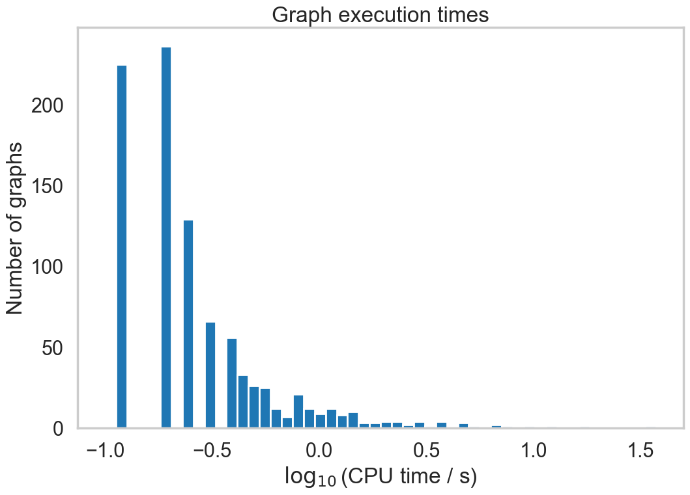
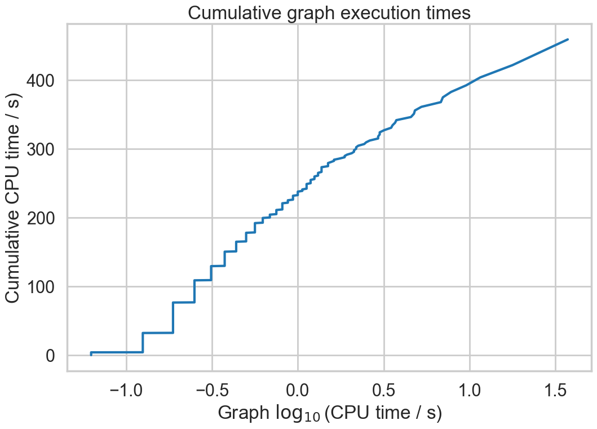
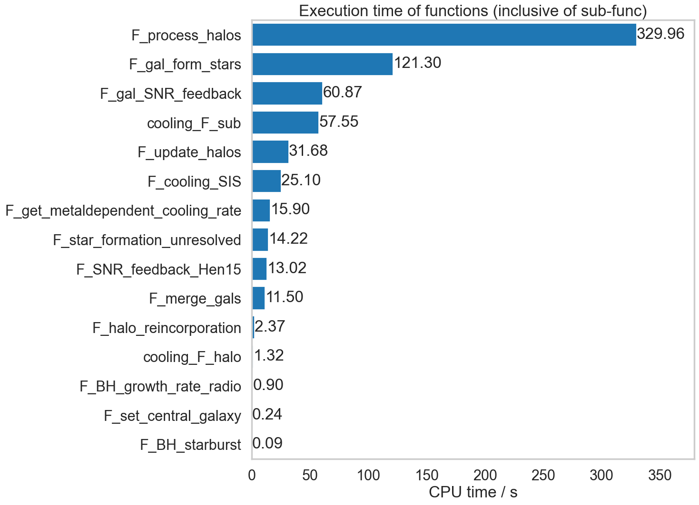

Profiling
=========

This page outlines the profiling of the code and documents the attempts to improve both CPU and memory usage.  Much of this has become outdated by the increased integration with C.

I am really not sure what tools to use for the best here.  One thing is certain, this needs to be done at the command line to avoid bloating the code: in particular :code:`jupyter notebook` is horrendously memory guzzling.  The inbuilt profiling tools are controlled by runtime boolean parameters :code:`b_profile_cpu` and :code:`b_profile_mem`.
However, with v0.2 of the code moving to C these have become much less useful so I will probably get rid of them.

I have yet to investigate profiling of the C code as the python bookkeeping still dominates.

All profiling mentioned below was undertaken on the first 1000 halos of Mill/pygal_063_5.hdf5 with verbosity set to 0 (ie minimal output) and with standard optimisation (:code:`-O`) enabled.

CPU time
--------

See `https://realpython.com/python-timer/#the-python-timer-code <https://realpython.com/python-timer/#the-python-timer-code>`_ for hints.

Of the three methods described below, I have found :code:`cProfile` to be the most useful: it does not require editing of the code and it produces a modest-sized profile file.

cProfile
^^^^^^^^

This is a command line tool that can tell you in which functions the code spends most of its time.  It is easy to use as it requires no modification to the code itself: :code:`python -O -m cProfile -o output_dir/L-Galaxies.prof L-Galaxies.py`.

Then analyse using :code:`python -m pstats output_dir/L-Galaxies.prof` which pops you into an interactive interface.  The recommended basic commands are:

* :code:`strip` – cleans the output;
* :code:`sort (tot|cum)time` – sorts by time spent in functions excluding (tot) or including (cum) subfunctions
* :code:`stats #` – shows the top #  entries.
  
Once you know which function/method is taking most of the time, then you can use a line profiler to determine which individual lines of code are at fault.  This requires an :code:`@profile` directive to be placed in front of the function to be profiled.

* :code:`pip install line_profiler`
* :code:`kernprof -lv -o output_dir/L-Galaxies.py.lprof L-Galaxies.py`
* :code:`python -m line_profiler output_dir/L-Galaxies.py.lprof`

Because the internal profiling takes up significant resources, the following timings were run with both :code:`b_profile_cpu=False` and :code:`b_profile_mem=False`.  They also had star formation histories enabled, :code:`b_SFH=True`.

v0.1
%%%%

Prior to any attempt to move any code to C, these were the timings on my MacBook Pro, 2.3 GHz 8-Core Intel Core i9, 16 GB

         505608955 function calls (471733059 primitive calls) in 518 seconds

.. list-table::
   :widths: 10 10 10 70
   :header-rows: 1
		 
   * - ncalls
     - tottime
     - cumtime
     - filename:lineno(function)
   * - 6040454
     - 112
     - 128
     - star_formation_and_feedback.py:15(F_gal_form_stars)
   * - 46895
     - 58
     - 70
     - gals.py:237(append)
   * - 163604
     - 50
     - 357
     - driver.py:55(F_process_halos)
   * - 6047421
     - 46
     - 69
     - star_formation_and_feedback.py:155(F_gal_SNR_feedback)
   * - 1536069
     - 33
     - 63
     - cooling.py:130(F_sub)
   * - 46895
     - 26
     - 45
     - driver.py:170(F_update_halos)
   * - 546477
     - 22
     - 26
     - sfh.py:203(F_sfh_update_bins)
   * - 2403
     - 15
     - 15
     - dataset.py:858(__setitem__)
   * - 1536069
     - 15
     - 20
     - cooling.py:270(F_get_metaldependent_cooling_rate)
   * - 6047421
     - 13
     - 13
     - star_formation_and_feedback.py:112(F_star_formation_unresolved)

As can be seen:

* Most of the work is undertaken within :code:`F_process_halos`, i.e. within the astrophysics routines.
* The bookkeeping within :code:`F_update_halos` takes much less CPU.

During optimisation of v0.1, the line profiler (not shown here) had also revealed the following:

* Accidental leaving of units within the main body of the code is very slow.
* Use of column headings in numpy structured arrays takes up most of the time -- could be effectively eliminated by interfacing with C.
* Manipulation of halo and subhalo class instances is slow but does not seem to dominate.

That suggests that significant speed-up could be achieved by:

* Defining a (static?) C struct to hold the internal parameters that are currently attributes of `parameters.py`.
* Defining a (static?) C struct to hold the internal variabless that are currently stored in `commons.py`.
* Associating the `gals` numpy structured array with an equivalent array of C structures (possibly only one at a time rather than an array).
* Changing all the routines below :code:`F_update_halos` (ie most of them!) to C equivalents.

v0.2
%%%%

After converting most of the astrophysics routines to C, and with exactly the same flags and identical output on a test run, these are the timings:

         234767941 function calls (234706396 primitive calls) in 445 seconds

.. list-table::
   :widths: 10 10 10 70
   :header-rows: 1
		 
   * - ncalls
     - tottime
     - cumtime
     - filename:lineno(function)
   * - 163604
     - 96
     - 258
     - driver.py:17(F_process_halos)
   * - 33293342
     - 56
     - 80
     - ctypeslib.py:184(from_param)
   * - 46895
     - 48
     - 64
     - gals.py:243(append)
   * - 33293342
     - 39
     - 39
     - __init__.py:511(cast)
   * - 46895
     - 35
     - 58
     - driver.py:130(F_update_halos)
   * - 33293342
     - 21
     - 21
     - _internal.py:249(__init__)
   * - 33293342
     - 20
     - 59
     - _internal.py:266(data_as)
   * - 2403
     - 19
     - 20       
     - dataset.py:858(__setitem__)
   * - 33293342
     - 12
     - 71
     - _internal.py:344(as_parameter\_)
   * - 46895
     - 10
     - 12
     - subs.py:306(append)

Here we see that:

* The astrophysics routines have effectively disappeared from the output.
* However, this has **not** resulted in a huge saving in time overall.  The time taken within the astrophysics functions has been largely replaced by overhead that seems most likely to be associated with using :code:`ctypes` in the function calls.  This then necessitates one of the following:
  
  - Change the way that :code:`ctypes` is used to make the overhead less demanding, or
  - Progress the C implementation by converting the whole of `driver.py` into C.  This will also require replacing halo and subhalo classes with numpy arrays and functions.

  I suspect that the latter approach will be needed anyway to make the code run super-efficiently, as most halos adn subhalos require very little astrophysics work and the overhead associated with a class instance is too great to be justifiable.
       

C_time class
^^^^^^^^^^^^

A simple class that holds a dictionary of numpy records:

* `key` – name of the record
* `value` – n_start, n_stop, cpu_time_start, cpu_time_total
  
with methods:

* `__repr__` – prints out the dictionary.
* `dump(filename)` – saves the dictionary as a pickle file `filename`.
* `start(name)` – adds an entry to the dictionary with key `name`, or reopens an existing one.
* `stop(name)` – accumulates the time spent in cpu_time_total.
  
This routine should be relatively lightweight.  It is used to track the time taken to process each graph.  The following plots show the distribution of process times on the first 1000 graphs in Millennium File 5.  This is for the pure python version of the code (ie v0.1).

codetiming.Timer
^^^^^^^^^^^^^^^^

`https://pypi.org/project/codetiming/ <https://pypi.org/project/codetiming/>`_

This can be used as a decorator to profile individual python functions.  It is useful but the output seems incredibly bloated.  For example, on processing just 1000 halos it produces an output file that is 300MB in size.  

The following plot shows the function process times on the first 1000 graphs in Millennium File 5.  Note that these times are *inclusive* of subfunctions.  

Somewhat surprisingly, :code:`F_sfh_update_bins` does not appear in this listing, even though :code:`cProfile` has it as the second most CPU-hungry routine.

Overall, :code:`cProfile` seems to be much less resource-hungry and more useful.

Memory usage
------------

To follow once CPU optimisation is complete.  The expectation, however, is that :code:`py-galaxies` should be memory efficient as it only loads in halos, subhalos and galaxies for two snapshots of a single graph at a time.
