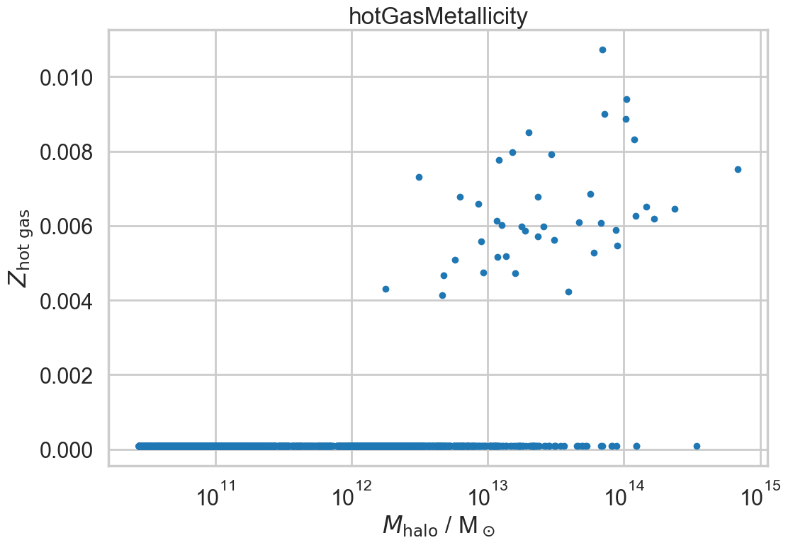
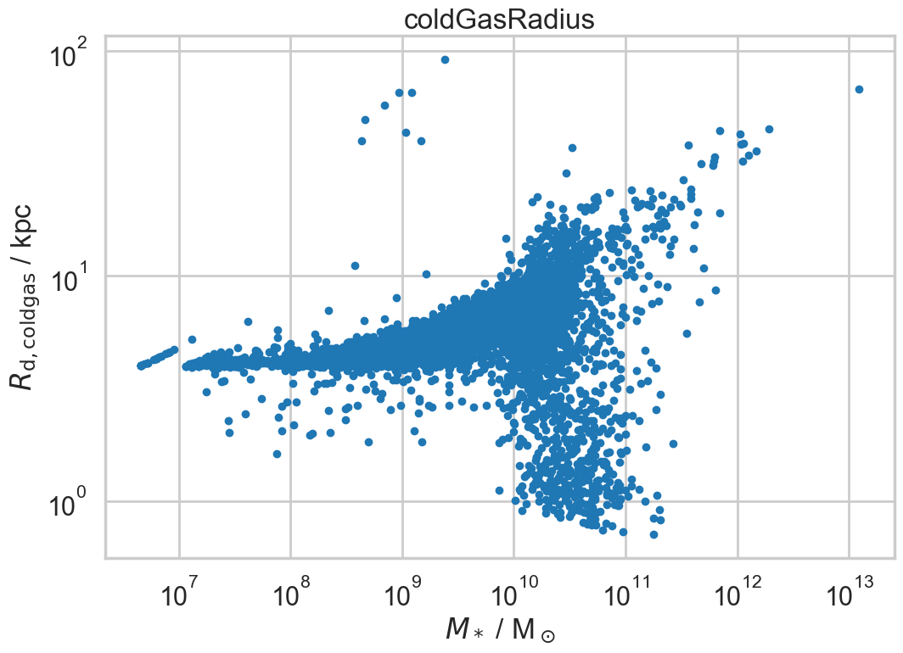
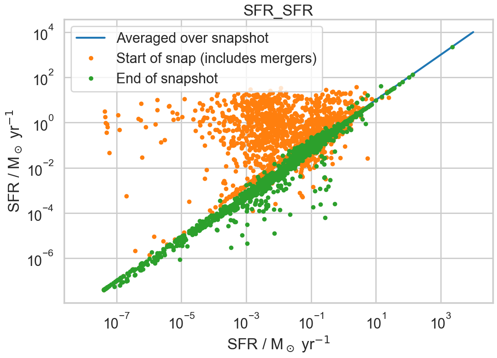

Results
=======

This section shows results for various physical properties of halos, subhalos and galaxies at different stages of code development.
The subsections refer to tags in the git repository.

Pre_CPU_optimisation
--------------------

These results come from trees derived from Millennium File 5.  Halos that have no descendant in the final snapshot are omitted.  Missing halos are inserted to ensure no snapshots are skipped in a halo's evolution.  It is clear during the run and from the results that the translation from the Millennium tree file to the py-galaxies input format is not perfect.  In particular:

* At run-time, one halo is found to have a descendant pointer of -1 (which should be impossible)
  - :code:`halo = graph_ID = 122 , snap_ID = 47 , halo_gid = 945`
  - :code:`halo.desc_start_gid = -1`
  - :code:`halo.desc_end_gid = 0`
* There is at least one family of halos visible in the output with peculiar properties and a very high baryon fraction.

Nonetheless, these results show that the code is at least achieving the basics of what one would hope for a semi-analytic model.

Halo properties
^^^^^^^^^^^^^^^

The above figure shows some worrying features:

* The majority of massive halos (:math:`M>10^{10}\mathrm{M}_\odot`) have baryon fractions significantly higher than the universal mean.
* Six halos have ridiculous baryon fractions of greater than unity.  That is allowed here because the mass of halo is defined solely in terms of the DM mass, but only makes sense if the halos have decreased enormously in mass over their evolution: for the highest mass halos, this seems unlikely.

I think that these arise from issues with the Millennium trees (after my conversion to :code:`py-galaxies` input format) because earlier results with MEGA halos did not show the same behaviour.  For now, I will ignore until I have better input trees/graphs.

The hot gas content of halos is minimal.  This is because in the Millennium trees, there are no subhalos and so a subhalo has been added whose properties match that of the halo: during cooling, any hot gas is then passed immediately from halo to subhalo.

The metallicity of the hot gas that does exist in halos seems plausible.

The ejected gas content of halos is approximately :math:`2\times10^9\mathrm{M}_\odot` in this model, independent of halo mass, albeit with a large scatter.  In the lowest mass halos, almost all the baryons exist in the ejected phase.  
The metallicity of the ejected gas again seems plausible.

Subhalo properties
^^^^^^^^^^^^^^^^^^

Here we can see that the majority of baryons in halos (including contained structures) are in the form of hot gas residing in subhalos -- again, this is partly due to the artificial nature of subhalos in the Millennium trees: the hot gas would otherwise presumable be shared between halos and subhalos.  Except in the lowest-mass (sub)halos, the metallicity of the gas is lower than that in the ejected phase.

Galaxy properties
^^^^^^^^^^^^^^^^^

.. image:: figs/pre_CPU_optimisation/python_gal_coldgas_halo.png
   :width: 49%
   :alt: The cold gas content of galaxies at the current day versus the mass of the host halo

These plot shows the cold gas content of galaxies versus that of the subhalo (left) and halo (right).  For these Millennium trees the only difference is that the right hand plot shows additional `orphan` galaxies whose host (sub)halo has been disrupted: ie where halos have merged together.

It is not entirely obvious to me why there are three distinct `main sequences` in these plots: there is nothing intrinsic in the model that should produce this effect.  I can only assume that this again is a peculiarity of the Millennium trees.

The metallicity and exponential disc radius of the cold gas contained within galaxies at the current day, versus the stellar mass of the galaxies.  All looks very plausible except for the eight galaxies around :math:`M\sim10^{9}\mathrm{M}_\odot` which have very large radii: I assume that this is a tree error.

These plot shows the stellar content of galaxies versus that of the subhalo (left) and halo (right).  For these Millennium trees the only difference is that the right hand plot shows additional `orphan` galaxies whose host (sub)halo has been disrupted: ie where halos have merged together.

The above plot shows the fractional stellar content of halos, i.e. the total stellar mass of all contained galaxies divided by the halo mass.  It shows the desired peak at intermediate masses.

This plot shows the star formation rate of galaxies at the beginning, end and averaged over snapshots.  Note that most of the orange points on the left lie underneath the green ones.  The reason for orange points sometimes greatly exceeding green points is that they include all starbursts due to galaxy mergers that currently happen at the beginning of a snapshot interval.  The takeway from this plot is that the star formation rate averaged over a snapshot is not very different from that in individual mini-steps, unless a merger has just taken place.

The specific star formation rate of galaxies shows a plausible behaviour, declining with increasing stellar mass.  The relatively high rates in galaxies with :math:`M_*<10^{8}\mathrm{M}_\odot` should probably not be taken too seriously.

